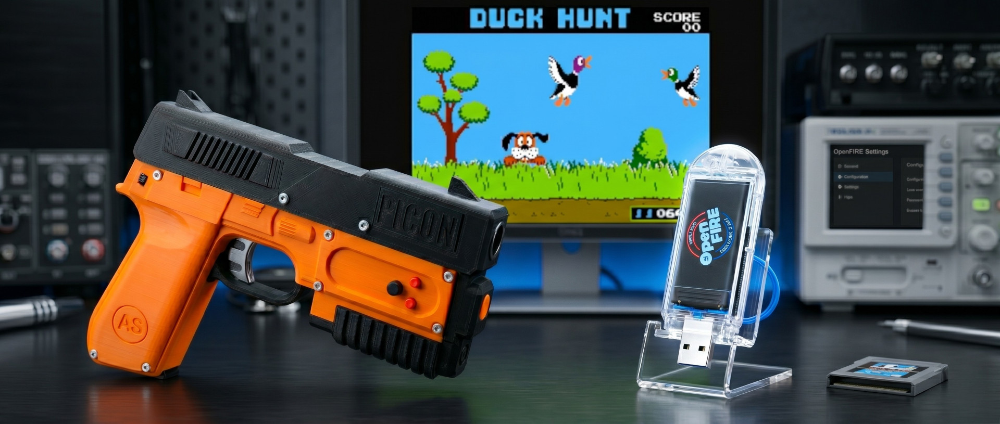
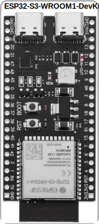
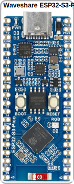
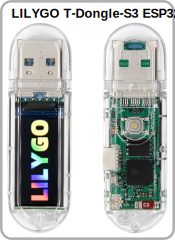
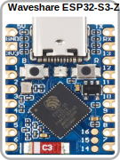

  <a href="#english-version"> English Version</a> &nbsp;•&nbsp; <a href="#versione-italiana"> Versione Italiana</a>

# OpenFIRE Firmware for ESP32

      

  

  <b>TECHNICAL DOCUMENTATION:</b> 
  <a href="lightgun/README.md#english-version">🔫 Lightgun Module</a> &nbsp; | &nbsp; <a href="dongle/README.md#english-version">📶 Dongle Receiver</a> &nbsp; | &nbsp; <a href="pedal/README.md#english-version">🦶 Wireless Pedal</a>

  

---
> 🛠️ **Hardware sponsored by [PCBWay](https://www.pcbway.com)**
---

## Introduction - what is OpenFIRE-firmware *(The Open Four Infra-Red Emitter Light Gun System)*
*... from the [OpenFIRE](https://openfirelightgun.org/) project homepage:*
>OpenFIRE Lightgun is a feature-rich open-source firmware to allow lightgun enthusiasts to build their own lightgun that will work on modern flat screen displays. OpenFIRE uses small infrared LEDs mounted to the perimeter of your display arranged in a rectangle pattern with two on top and two on bottom (dual sensor bar) or a diamond pattern (one at the middle of each side). An infrared detecting camera mounted inside the lightgun is used to track the position of the infrared LEDs to aim your lightgun.
>The OpenFIRE firmware is software that is programmed onto a microcontroller circuit board inside your lightgun. When the trigger is pulled or a button pressed, the firmware sends the appropriate command to your emulator via USB or Bluetooth. The firmware also controls feedbacks such as a solenoid, rumble motor or RGB LEDs to enhance your gaming experience.
>The [OpenFIRE App/GUI](https://github.com/TeamOpenFIRE/OpenFIRE-App) is software that runs on your Windows or Linux computer and is used to configure and test your OpenFIRE lightgun.

## What is the OpenFIRE-firmware port for ESP32

This repository hosts an advanced port of the [OpenFIRE-firmware](https://github.com/TeamOpenFIRE/OpenFIRE-Firmware) project, developed by TeamOpenFIRE, adapted and optimized for the **ESP32-S3** microcontroller architecture.

The main goal of this work is to introduce native support for **wireless gameplay via ESP-NOW**. The aim is to enable completely cable-free operation while simultaneously maintaining real-time responsiveness and behavior aligned with a directly connected PC system under typical usage conditions.

Furthermore, the **tracking system has been refined**. The integration of anti-jitter techniques, better rotation handling, and increased tolerance to the temporary loss of IR emitter visibility contribute to a more stable and fluid cursor behavior. The result is more consistent tracking across different usage scenarios, with good precision even near the edges of the screen and greater flexibility in the operating distance from the monitor.

## Main Features and Capabilities
The firmware transforms the microcontroller into a highly advanced lightgun controller, offering the following core features (inherited from the original project):

* **Advanced IR Tracking:** Utilizes a four-point infrared system with real-time perspective correction. Supports multiple emitter configurations, including double lightbar (recommended) or diamond layouts, ensuring absolute precision regardless of the player's angle to the screen.
* **Complete Peripheral Support:** Native management of tactile and force feedback (Solenoid and Rumble motor), temperature monitoring via TMP36 sensor, and dynamic lighting via WS2812B NeoPixel LEDs.
* **Flexible Inputs and Mapping:** The system provides simultaneous outputs such as Keyboard, 5-button Absolute Positioning Mouse (ABS), and dual-stick Gamepad (with D-pad support). It offers a robust button mapping system configurable for any need.
* **Dedicated App and Internal Memory:** Full integration with the **[OpenFIRE App](https://github.com/TeamOpenFIRE/OpenFIRE-App)** for cross-platform, on-the-fly configuration. Calibration profiles and user settings are saved directly to the lightgun's internal memory, making it portable across different PCs without needing to run the setup again.
* **OLED Visual Feedback:** Support for I2C SSD1306 displays, used for menu navigation and providing visual indicators for in-game elements (e.g., life count, ammo).
* **Advanced Compatibility:** Fully compatible with PC Force Feedback handlers (such as Mame Hooker, The Hook Of The Reaper, and QMamehook) and the MiSTer FPGA ecosystem.
* **Dual-Core Optimization:** Leverages the microcontroller's dual-core capabilities to simultaneously manage input polling, camera processing, and peripheral management without any slowdowns.

## Project Philosophy and Porting
The OpenFIRE-Firmware-ESP32 firmware stems from the need to bring the features of a professional open-source lightgun to an architecture that allows maximum freedom of movement. The code was developed using the PlatformIO ecosystem and, while introducing structural innovations for wireless management, maintains extremely high logical and functional fidelity to the original TeamOpenFIRE code.

The distinctive features of this port include:

* **Transparent Wireless Integration**: The implementation of the ESP-NOW protocol allows direct communication between the peripheral and a dedicated dongle connected to the PC. This solution is designed to be totally transparent: the operating system detects the lightgun as a standard USB peripheral, with no perceivable latency and no need for third-party drivers or software.

* **Enhanced Tracking Algorithms:** This port introduces deep refinements to the spatial calculation algorithms. The system now offers exceptional cursor stability even at very close distances and correctly calculates tracking even during wide rotations of the lightgun on its axis (tilt). At the end of the testing phase, if these implementations prove solid and superior, it is my intention to propose a Pull Request (PR) to the original project so that the entire OpenFIRE community can benefit from them.

* **Fidelity to the Original Code**: Excluding the necessary adaptations for the ESP32 architecture and radio transmission management, the core control logic remains consistent with the official version. This ensures that improvements and fixes made by TeamOpenFIRE can be cyclically integrated into this repository.

* **Hardware Versatility**: Although the project is focused on the wireless capabilities of the ESP32-S3, the code maintains compatibility with the RP2040 microcontroller. In the latter case, operation is limited to a wired USB connection, while still maintaining firmware uniformity within the OpenFIRE ecosystem.

Special thanks to TeamOpenFIRE for their excellent work in creating the original firmware; they deserve credit for the core architecture and our gratitude for making such an advanced system available to the community.

## Supported Microcontrollers
The firmware has been tested and optimized for the **ESP32-S3** architecture, which is the reference microcontroller for this project. The system relies entirely on the dual-core power and connectivity of the **ESP32-S3**, which supports all features, including wireless communication via ESP-NOW and HID management via USB OTG. *(e.g., ESP32-S3-WROOM1-DevKitC-1, Waveshare ESP32-S3-PICO, Waveshare ESP32-S3-ZERO, LILYGO T-Dongle-S3, ESP32-S3 Pocket Dongle S3)*.

For best results and maximum ease of assembly, the following form factors are recommended:

| Device | Recommended Boards | Usage |
| :--- | :---: | :--- |
| **Lightgun** |   | **ESP32-S3-DevKitC-1 / Waveshare S3-PICO** Ideal for integration within the gun shell due to the high number of GPIO pins, necessary to easily manage all buttons, the sensor, and actuators. |
| **Dongle** |   | **LILYGO T-Dongle-S3 / Pocket Dongle S3** "Turnkey" solutions with integrated USB connector. Perfect as compact receivers to connect directly to the PC or console, without the need for cables or soldering. |
| **Pedal** |  | **Waveshare ESP32-S3-ZERO** Thanks to its ultra-compact dimensions, it is the perfect choice to be placed inside a wireless pedal structure, where space is limited and very few pins are needed. |

**Hardware Versatility and Interchangeability**
Except for the "USB Sticks" (like the LILYGO T-Dongle or Pocket Dongle), which by their physical nature are designed exclusively for PC use as receivers, **all other standard boards are universal**. 
A board like the DevKitC-1, PICO, or ZERO can be programmed and used interchangeably for the Lightgun, the Pedal, or even to build a "DIY" Dongle by wiring a USB plug. Specific hardware configuration details are illustrated in their respective folders.

> *Compatibility Note: Although the code maintains basic compatibility with the original RP2040 architecture, its use remains strictly limited to wired USB connections. Active development, optimization, and all advanced wireless features are focused exclusively on the ESP32-S3 platform.*

## System Architecture
The project is divided into three modular components, each with specific technical documentation within their respective folders:

1. ***Lightgun Firmware***
   The main firmware that manages the IR sensor, button logic, and feedback peripherals (solenoid, rumble, LEDs). It can operate in both wireless and wired modes.
   Technical documentation: **[Lightgun Folder](lightgun/README.md#english-version)**

2. ***Receiver Dongle***
   The Dongle acts as an invisible bridge between the lightgun and the PC. It handles the reception of ESP-NOW packets and translates the data into standard HID protocols.
   Technical documentation: **[Dongle Folder](dongle/README.md#english-version)**

3. ***Wireless Pedal***
   An optional but essential accessory for certain cover shooter titles (e.g., Time Crisis). It communicates directly with the lightgun to send ultra-low latency input signals, eliminating the need for bulky wiring on the floor.
   Technical documentation: **[Pedal Folder](pedal/README.md#english-version)**

## 💻 Quick Installation (Web Flasher)

The easiest, fastest, and safest way to install or update the firmware for any module (Lightgun, Dongle, or Pedal) is using our unified Web Flasher. It requires no external drivers or software: everything runs directly within your browser.

* **Requirements:** PC/Mac with Google Chrome, Microsoft Edge, or Opera.

👉 **[LAUNCH OPENFIRE ESP32 WEB FLASHER](https://alessandro-satanassi.github.io/OpenFIRE-ESP32-WebFlasher/?lang=en)**

> **Note for advanced users:** If your browser does not support the Web Flasher, or if you prefer to proceed via command line or external tools, you can find the manual `.bin` flashing instructions in the technical documentation of each specific module (Lightgun, Dongle, or Pedal).

## Connectivity Management
The firmware intelligently manages connection priorities:

* **Wired Connection**: If the lightgun is connected to the PC via a USB cable, the system disables wireless scanning and operates as a direct HID peripheral.

* **Wireless Connection**: In the absence of a USB connection, the lightgun activates ESP-NOW mode. The pairing process is completely automatic and requires no user intervention: the dongle connected to the PC handles scanning the environment to select the radio channel with the least interference. The lightgun then searches for an available dongle and pairs with it. Immediately after, if a wired pedal is not already configured, the lightgun starts a 10-second search to locate and pair an available wireless pedal (the use of which is entirely optional; the system works perfectly without it). Once the connection is established, the PC will manage the peripheral exactly as if it were connected via cable, with no operational difference.
In the event of a power-off and subsequent restart of the lightgun, the system will prioritize searching for the last paired dongle and pedal to ensure instant reconnection; if it does not detect them, it will automatically start a new search. *(Note: this instant reconnection is only possible if the dongle and pedal have remained continuously powered on since the first pairing; if they are rebooted, they will reset and listen for new connections, requiring a new scan from the lightgun)*.

* **Visual Feedback**: If the system is equipped with a display, the interface will show dedicated icons to distinguish the connection state (USB or Wireless) and monitor the link status (on the lightgun and dongle displays, or via 4 dedicated LEDs on the pedal).

## PICON-AS Hardware Project
For those who wish to build a fully battery-operated wireless lightgun based on this firmware, the **PICON-AS** reference hardware project is available. This is a lightgun derived from the PICON-OG project, optimized to integrate a rechargeable 21700 Li-ion battery and support the cable-free wireless ecosystem.
This project provides detailed assembly instructions, complete with STL files for 3D printing and wiring diagrams.

Hardware manual: **[PICON-AS Documentation Site](https://alessandro-satanassi.github.io/OpenFIRE-PICON-AS-ESP32/)**

> [!NOTE]
> The site is already usable and the technical content is correct; we are just finalizing the drafting of some instruction sections. Currently, the site is only available in Italian, but it will be translated into English once completed.

## 💬 Community and Support

Depending on the type of support you need, you can join two different Discord communities:

* **Official OpenFIRE Server:** The main hub for the firmware. If you have questions about the software, technical issues, or want to follow the updates, this is the right place. **Make sure to visit the `#software-ports` channel**, where we specifically discuss this ESP32 port!
 

* **DIY Lightgun Builders:** The perfect place if you need advice on hardware construction, 3D printing, soldering, or if you simply want to show off your finished PICON-AS (inside this server you will also find a channel dedicated to the **`#Picon-AS`**).
 

**Useful Resources and Websites:**
In addition to the Discord servers, you can check out the following websites:
* [OpenFIRE Firmware (Official Site)](https://openfirelightgun.org/)
* [DIY Lightgun](https://diylightgun.com/lightguns/?pt=lightgun)
* [Picon-AS (Picon-AS lightgun website)](https://alessandro-satanassi.github.io/OpenFIRE-PICON-AS-ESP32/)

**Related GitHub Repositories:**
* [OpenFIRE Firmware ESP32 (This repository)](https://github.com/alessandro-satanassi/OpenFIRE-Firmware-ESP32)
* [OpenFIRE Firmware (Original RP2040)](https://github.com/TeamOpenFIRE/OpenFIRE-Firmware)
* [OpenFIRE App (PC GUI for lightgun configuration)](https://github.com/TeamOpenFIRE/OpenFIRE-App)
* [OpenFIRE Boards (For developers wanting to add a new board to the project)](https://github.com/TeamOpenFIRE/OpenFIRE-Boards)

## 🤝 Sponsorship & Support

A special thanks to **[PCBWay](https://www.pcbway.com)** for sponsoring the hardware development of this project. Their professional PCB manufacturing service has been fundamental in transforming our schematics into reliable, high-quality physical boards.

We chose PCBWay for their:
* **Manufacturing Precision:** Excellent solder mask and silkscreen quality even on dense designs.
* **Reliability:** Consistent build quality across different batches.
* **Fast Prototyping:** Quick turnaround times that significantly accelerated our testing phase.

  

## 🙏 Credits & Acknowledgments

### Original OpenFIRE Core Team & Contributors
A special thanks to the original authors and the OpenFIRE community, without whom this port and the ecosystem expansions (Dongle and Pedal) would never have existed:
* **That One Seong** (`SeongsSeongs@gmail.com`): The lead developer and coordinator of the OpenFIRE project.
* **Samuel Ballantyne (Samco)** (`samuelballantyne@hotmail.com`): For his original SAMCO project, the gorgeous OpenFIRE branding, and perspective-based tracking system.
* **Mike Lynch (Prow7)**: For his enhanced SAMCO fork which provided the basis of pause mode and saving subsystems.
* **Odwalla-J, mrkylegp, RG2020 & lemmingDev**: For prerelease consultation, bug testing, and feedback.
* **The IR-GUN4ALL testers**: For their early feedback and feature requests. This wouldn't have happened without you lot!
* **Chris Young**: For his TinyUSB compatible library (now part of `TinyUSB_Devices`).

### ESP32 Port Contributors
A massive thank you to those who personally supported the development and testing of this specific ESP32 port:
* **Reverse Cosmos**: For his invaluable help and time spent testing the OpenFIRE ESP32 firmware.

## ⚖️ License, Commercial Use, and Forks

In full compliance with the original license and the vision of the OpenFIRE creators, this port adheres to the following guidelines regarding forks and commercial use:

* **No Rebranding:** Forks created solely for "rebranding" purposes (changing names and logos to present the project as one's own) are strongly **DISCOURAGED**. All forks derived from this repository must maintain the OpenFIRE name and credit both the original core authors (That One Seong, Samco, Prow7) and the author of this specific ESP32 Wireless port (Alessandro Satanassi).

* **Commercial Integrations:** Products intended to integrate OpenFIRE using this firmware (e.g., within pre-assembled lightguns for sale) must make its usage extremely clear and provide appropriate credits to both the core authors and the port author. Although it is Free Software, we ask anyone profiting from this volunteer work to consider a donation or sponsorship to the project.
  * For commercial inquiries, collaborations, or licensing regarding this specific **ESP32 port and the wireless ecosystem (Dongle/Pedal)**, please contact *Alessandro Satanassi* (`alessandro@cittini.it`).
  * For commercial or licensing inquiries regarding the **original OpenFIRE core**, please open a thread in the Discussions section of the [original repository](https://github.com/TeamOpenFIRE/OpenFIRE-Firmware) or contact *That One Seong* (`SeongsSeongs@gmail.com`) and/or *Samuel Ballantyne* (`samuelballantyne@hotmail.com`).

* **GNU LGPL Compliance:** As established by the *GNU Lesser General Public License*, any entity (private or commercial) wishing to incorporate parts or the entirety of this firmware's components **must make their source code modifications available to the public upon request**. 

* **Free Software (Anti-Scam):** OpenFIRE is Free Software, both in terms of "liberty" and "cost". If you have been charged any amount to download or use the OpenFIRE firmware, **you have been scammed and should demand an immediate refund!**

---

 🔸 🔸 🔸 

---

  <a href="#english-version"> English Version</a> &nbsp;•&nbsp; <a href="#versione-italiana"> Versione Italiana</a>

# OpenFIRE Firmware per ESP32

      

  

  <b>DOCUMENTAZIONE TECNICA:</b> 
  <a href="lightgun/README.md#versione-italiana">🔫 Modulo Lightgun</a> &nbsp; | &nbsp; <a href="dongle/README.md#versione-italiana">📶 Ricevitore Dongle</a> &nbsp; | &nbsp; <a href="pedal/README.md#versione-italiana">🦶 Pedale Wireless</a>

  

---
> 🛠️ **Hardware sponsored by [PCBWay](https://www.pcbway.com)**
---

## Premessa - cos'è OpenFIRE-firmware *(The Open Four Infra-Red Emitter Light Gun System)*
*... dal homepage del progetto [OpenFIRE](https://openfirelightgun.org/):*
>OpenFIRE Lightgun è un firmware open source ricco di funzionalità che consente agli appassionati di costruire la propria lightgun compatibile con i moderni schermi piatti. OpenFIRE utilizza piccoli LED a infrarossi montati sul perimetro del display, disposti secondo uno schema rettangolare con due in alto e due in basso (configurazione a doppia barra sensore) oppure a diamante (uno al centro di ogni lato). Una telecamera a infrarossi montata all'interno della lightgun viene utilizzata per tracciare la posizione dei LED e consentire il puntamento.
>Il firmware OpenFIRE è il software che viene programmato sulla scheda del microcontrollore all'interno della lightgun. Quando viene premuto il grilletto o un pulsante, il firmware invia il comando appropriato all'emulatore tramite USB o Bluetooth. Il firmware gestisce inoltre i sistemi di feedback, come solenoidi, motori rumble o LED RGB, per arricchire l'esperienza di gioco.
>L' [App/GUI OpenFIRE](https://github.com/TeamOpenFIRE/OpenFIRE-App) è il software applicativo, compatibile con sistemi Windows o Linux, utilizzato per configurare e testare la tua lightgun OpenFIRE.

## Cos'è il porting di OpenFIRE-firmware per ESP32

Questo repository ospita un porting avanzato del progetto [OpenFIRE-firmware](https://github.com/TeamOpenFIRE/OpenFIRE-Firmware), sviluppato dal TeamOpenFIRE, adattato e ottimizzato per l'architettura del microcontrollore **ESP32-S3**.

L'obiettivo principale di questo lavoro è introdurre un supporto nativo al **gameplay wireless tramite ESP-NOW**. Lo scopo è consentire un'operatività totalmente priva di cavi, pur mantenendo al contempo una reattività in tempo reale e un comportamento allineato a un sistema con connessione diretta al PC in condizioni d'uso tipiche.

Inoltre, il **sistema di tracciamento è stato affinato**. L'integrazione di tecniche anti-jitter, una migliore gestione della rotazione e una maggiore tolleranza alla perdita temporanea della visibilità degli emettitori IR contribuiscono a un comportamento del cursore più stabile e fluido. Il risultato è un tracciamento più consistente tra i diversi scenari d’uso, con buona precisione anche vicino ai bordi dello schermo e una maggiore flessibilità nella distanza di utilizzo dal monitor.

## Caratteristiche e Funzionalità Principali
Il firmware trasforma il microcontrollore in un controller per lightgun estremamente avanzato, offrendo le seguenti funzionalità di base (ereditate dal progetto originale):

* **Tracciamento IR Avanzato:** Utilizza un sistema a quattro punti a infrarossi con correzione prospettica in tempo reale. Supporta configurazioni multiple degli emettitori, inclusi layout a doppia barra luminosa (consigliato) o a diamante, garantendo una precisione assoluta indipendentemente dall'angolazione del giocatore rispetto allo schermo.
* **Supporto Periferiche Completo:** Gestione nativa del feedback tattile e di forza (Solenoide e motore Rumble), monitoraggio della temperatura tramite sensore TMP36 e illuminazione dinamica tramite LED NeoPixel WS2812B.
* **Input Flessibili e Mappatura:** Il sistema fornisce output simultanei come Tastiera, Mouse a posizionamento assoluto (ABS) a 5 pulsanti e Gamepad dual-stick (con supporto D-pad). Offre un robusto sistema di mappatura dei pulsanti configurabile per ogni esigenza.
* **App Dedicata e Memoria Interna:** Piena integrazione con la **[OpenFIRE App](https://github.com/TeamOpenFIRE/OpenFIRE-App)** per una configurazione multipiattaforma e "al volo". I profili di calibrazione e le impostazioni dell'utente vengono salvati direttamente nella memoria interna della lightgun, rendendola portabile tra diversi PC senza dover rifare il setup.
* **Feedback Visivo OLED:** Supporto per display I2C SSD1306, utilizzati per la navigazione dei menu e per fornire indicazioni visive degli elementi in-game (es. conteggio vite, munizioni).
* **Compatibilità Avanzata:** Pienamente compatibile con i gestori di Force Feedback per PC (come Mame Hooker, The Hook Of The Reaper e QMamehook) e con l'ecosistema MiSTer FPGA.
* **Ottimizzazione Dual-Core:** Sfrutta le capacità dual-core del microcontrollore per gestire simultaneamente e senza rallentamenti il polling degli input, l'elaborazione della videocamera e la gestione delle periferiche.

## Filosofia del Progetto e Porting
Il firmware OpenFIRE-Firmware-ESP32 nasce dalla necessità di portare le funzionalità di una lightgun open-source professionale su un'architettura che consenta la massima libertà di movimento. Il codice è stato sviluppato utilizzando l'ecosistema PlatformIO e, pur introducendo innovazioni strutturali per la gestione del wireless, mantiene un'altissima fedeltà logica e funzionale rispetto al codice originale del TeamOpenFIRE.

Le caratteristiche distintive di questo porting includono:

* **Integrazione Wireless Trasparente**: L'implementazione del protocollo ESP-NOW permette una comunicazione diretta tra la periferica e un dongle dedicato collegato al PC. Questa soluzione è progettata per essere totalmente trasparente: il sistema operativo rileva la lightgun come una periferica USB standard, senza latenze percepibili e senza la necessità di driver o software di terze parti.

* **Algoritmi di Tracciamento Potenziati:** Questo porting introduce profondi affinamenti agli algoritmi di calcolo spaziale. Il sistema offre ora una stabilità del cursore eccezionale anche a distanze ravvicinate e calcola correttamente il tracciamento anche durante ampie rotazioni della lightgun sull'asse (tilt). Al termine della fase di testing, se queste implementazioni si confermeranno solide e superiori, è mia intenzione proporre una Pull Request (PR) al progetto originale affinché tutta la community di OpenFIRE possa beneficiarne.

* **Fedeltà al Codice Originale**: Ad esclusione degli adattamenti necessari per l'architettura ESP32 e per la gestione della trasmissione radio, il cuore della logica di controllo rimane coerente con la versione ufficiale. Questo garantisce che i miglioramenti e le correzioni apportate dal TeamOpenFIRE possano essere integrati ciclicamente in questo repository.

* **Versatilità Hardware**: Sebbene il progetto sia focalizzato sulle capacità wireless dell'ESP32-S3, il codice mantiene la compatibilità con il microcontrollore RP2040. In quest'ultimo caso, il funzionamento rimane limitato alla connessione cablata USB, mantenendo però l'uniformità del firmware all'interno dell'ecosistema OpenFIRE.

Si ringrazia il TeamOpenFIRE per l'eccellente lavoro svolto nella creazione del firmware originale; a loro vanno i meriti dell'architettura di base e la gratitudine per aver reso disponibile un sistema così avanzato alla comunità.

## Microcontrollori Supportati
Il firmware è stato testato e ottimizzato per l'architettura **ESP32-S3**, che è il microcontrollore di riferimento per questo progetto. Il sistema si basa interamente sulla potenza e sulla connettività dell'**ESP32-S3**, che supporta tutte le funzionalità, inclusa la comunicazione wireless via ESP-NOW e la gestione HID via USB OTG. *(ESP32-S3-WROOM1-DevKitC-1, Waveshare ESP32-S3-PICO, Waveshare ESP32-S3-ZERO, LILYGO T-Dongle-S3, ESP32-S3 Pocket Dongle S3)*.

Per ottenere i migliori risultati e la massima facilità di montaggio, si consigliano i seguenti form factor:

| Dispositivo | Board Consigliate | Utilizzo |
| :--- | :---: | :--- |
| **Lightgun** |   | **ESP32-S3-DevKitC-1 / Waveshare S3-PICO** Ideali per essere integrate all'interno della scocca della pistola grazie all'elevato numero di pin GPIO, necessari per gestire agevolmente tutti i pulsanti, il sensore e gli attuatori. |
| **Dongle** |   | **LILYGO T-Dongle-S3 / Pocket Dongle S3** Soluzioni "chiave in mano" con connettore USB integrato. Perfette come ricevitori compatti da collegare direttamente al PC o alla console, senza necessità di cavi o saldature. |
| **Pedale** |  | **Waveshare ESP32-S3-ZERO** Grazie alle sue dimensioni ultracompatte, è la scelta perfetta per essere inserita all'interno della struttura di un pedale wireless, dove lo spazio è ridotto e servono pochissimi pin. |

**Versatilità e Intercambiabilità dell'Hardware**
Fatta eccezione per le "USB Stick" (come il LILYGO T-Dongle o il Pocket Dongle) che per la loro natura fisica sono pensate esclusivamente per l'uso su PC come ricevitori, **tutte le altre schede standard sono universali**. 
Una board come la DevKitC-1, la PICO o la ZERO può essere programmata e utilizzata indistintamente per la Lightgun, per il Pedale o persino per costruire un Dongle "fai-da-te" cablando una presa USB. I dettagli specifici sulle configurazioni hardware sono illustrati nelle rispettive cartelle.

> *Nota di compatibilità: Sebbene il codice mantenga la compatibilità di base con l'architettura originale RP2040, il suo utilizzo rimane strettamente limitato alla connessione cablata USB. Lo sviluppo attivo, l'ottimizzazione e tutte le funzionalità wireless avanzate sono focalizzate esclusivamente sulla piattaforma ESP32-S3.*

## Architettura del Sistema
Il progetto si articola in tre componenti modulari, ognuno dei quali dispone di documentazione tecnica specifica all'interno delle relative cartelle:

1. ***Lightgun Firmware***
   Il firmware principale che gestisce il sensore IR, la logica dei pulsanti e le periferiche di feedback (solenoide, rumble, LED). Può operare sia in modalità wireless che via cavo.
   Documentazione tecnica: **[Cartella Lightgun](lightgun/README.md#versione-italiana)**

2. ***Dongle Ricevitore***
   Il Dongle agisce come ponte invisibile tra la lightgun e il PC. Gestisce la ricezione dei pacchetti ESP-NOW e traduce i dati in protocolli HID standard.
   Documentazione tecnica: **[Cartella Dongle](dongle/README.md#versione-italiana)**

3. ***Pedale Wireless***
   Un accessorio opzionale ma fondamentale per alcuni titoli cover shooter (es. Time Crisis). Comunica direttamente con la lightgun per inviare segnali di input a bassissima latenza, eliminando la necessità di cablaggi ingombranti sul pavimento.
   Documentazione tecnica: **[Cartella Pedal](pedal/README.md#versione-italiana)**

## 💻 Installazione Rapida (Web Flasher)

Il modo più semplice, veloce e sicuro per installare o aggiornare il firmware di qualsiasi modulo (Lightgun, Dongle o Pedale) è utilizzare il nostro Web Flasher unificato. Non richiede l'installazione di driver o software esterni: viene eseguito interamente dal tuo browser.

* **Requisiti:** PC/Mac con Google Chrome, Microsoft Edge o Opera.

👉 **[AVVIA OPENFIRE ESP32 WEB FLASHER](https://alessandro-satanassi.github.io/OpenFIRE-ESP32-WebFlasher/?lang=it)**

> **Nota per utenti esperti:** Se il tuo browser non supporta il Web Flasher, o se preferisci procedere tramite riga di comando o tool esterni, puoi trovare le istruzioni per il flashing manuale dei file `.bin` all'interno della documentazione tecnica di ogni specifico modulo (Lightgun, Dongle o Pedale).

## Gestione della Connettività
Il firmware gestisce in modo intelligente la priorità delle connessioni:

* **Connessione Cablata**: Se la lightgun viene collegata al PC tramite cavo USB, il sistema disabilita la scansione wireless e opera come una periferica HID diretta.

* **Connessione Wireless**: In assenza di collegamento USB, la lightgun attiva la modalità ESP-NOW. Il processo di accoppiamento è completamente automatico e non richiede alcun intervento da parte dell'utente: è il dongle collegato al PC a occuparsi della scansione dell'ambiente per selezionare il canale radio con minori interferenze. La lightgun cerca quindi un dongle libero e vi si associa. Subito dopo, se non è già configurato un pedale cablato, la lightgun avvia una ricerca di 10 secondi per individuare e accoppiare un pedale wireless libero (il cui utilizzo rimane comunque facoltativo, il sistema funziona perfettamente anche senza). Una volta stabilita la connessione, il PC gestirà la periferica esattamente come se fosse collegata via cavo, senza alcuna differenza di funzionamento.
In caso di spegnimento e successivo riavvio della lightgun, il sistema cercherà in via prioritaria l'ultimo dongle e l'ultimo pedale associati per garantire una riconnessione istantanea; se non li rileva, avvierà automaticamente una nuova ricerca. *(Nota bene: questa riconnessione istantanea è possibile solo se il dongle e il pedale sono rimasti ininterrottamente accesi dopo il primo accoppiamento; se vengono riavviati, si resetteranno mettendosi in ascolto di nuove connessioni, richiedendo una nuova scansione da parte della lightgun)*.

* **Feedback Visivo**: Se il sistema è dotato di display, l'interfaccia mostrerà icone dedicate per distinguere lo stato della connessione (USB o Wireless) e monitorare lo stato del collegamento (sui display di lightgun e dongle, o tramite 4 LED dedicati sul pedale).

## Progetto Hardware PICON-AS
Per chi desidera realizzare una lightgun wireless funzionante completamente a batteria basata su questo firmware, è disponibile il progetto hardware di riferimento **PICON-AS**. Si tratta di una lightgun derivata dal progetto PICON-OG, ottimizzata per integrare una batteria Li-ion 21700 ricaricabile e supportare l'ecosistema wireless senza cavi.
Tale progetto fornisce istruzioni dettagliate per l'assemblaggio, completo di file STL per la stampa 3D e schemi elettrici.

Manuale hardware: **[Sito Documentazione PICON-AS](https://alessandro-satanassi.github.io/OpenFIRE-PICON-AS-ESP32/)**

> [!NOTE]
> Il sito è già fruibile e i contenuti tecnici sono corretti; stiamo solo ultimando la stesura di alcune sezioni delle istruzioni. Al momento il sito è solo in lingua italiana, sarà tradotto in inglese quando sarà completato.

## 💬 Community e Supporto

A seconda del tipo di supporto di cui hai bisogno, puoi unirti a due diverse community su Discord:

* **Server Ufficiale OpenFIRE:** Il fulcro principale per il firmware. Se hai domande sul software, problemi tecnici o vuoi seguire gli aggiornamenti, questo è il posto giusto. **Assicurati di visitare il canale `#software-ports`**, dove parliamo specificatamente di questo porting per ESP32!
 

* **DIY Lightgun Builders:** Il posto perfetto se ti servono consigli sulla costruzione hardware, la stampa 3D, le saldature, o se vuoi semplicemente mostrare la tua PICON-AS terminata (all'interno di questo server troverai anche un canale dedicato alla **`#Picon-AS`**).
 

**Risorse e Siti Web Utili:**
Oltre ai server Discord, puoi consultare i seguenti siti web:
* [OpenFIRE Firmware (Sito Ufficiale)](https://openfirelightgun.org/)
* [DIY Lightgun](https://diylightgun.com/lightguns/?pt=lightgun)
* [Picon-AS (Sito della lightgun Picon-AS)](https://alessandro-satanassi.github.io/OpenFIRE-PICON-AS-ESP32/)

**Repository GitHub Correlati:**
* [OpenFIRE Firmware ESP32 (Questo repository)](https://github.com/alessandro-satanassi/OpenFIRE-Firmware-ESP32)
* [OpenFIRE Firmware (Originale RP2040)](https://github.com/TeamOpenFIRE/OpenFIRE-Firmware)
* [OpenFIRE App (GUI PC per la configurazione della lightgun)](https://github.com/TeamOpenFIRE/OpenFIRE-App)
* [OpenFIRE Board (per sviluppatori che vogliono inserire una nuova board al progetto)](https://github.com/TeamOpenFIRE/OpenFIRE-Boards)

## 🤝 Sponsorizzazione e Supporto

Un ringraziamento speciale a **[PCBWay](https://www.pcbway.com)** per aver sponsorizzato lo sviluppo hardware di questo progetto. Il loro servizio professionale di produzione di PCB è stato fondamentale per trasformare i nostri schemi elettrici in schede fisiche affidabili e di alta qualità.

Abbiamo scelto PCBWay per:
* **Precisione di Produzione:** Eccellente qualità del solder mask e della serigrafia anche su design ad alta densità.
* **Affidabilità:** Qualità costruttiva uniforme e costante su diversi lotti di produzione.
* **Prototipazione Rapida:** Tempi di realizzazione brevi che hanno accelerato significativamente la nostra fase di test.

  

## 🙏 Crediti e Ringraziamenti

### Team Originale e Contributori di OpenFIRE
Un ringraziamento speciale agli autori originali e alla community del progetto OpenFIRE, senza i quali questo porting e le espansioni dell'ecosistema (Dongle e Pedale) non sarebbero mai esistiti:
* **That One Seong** (`SeongsSeongs@gmail.com`): Lo sviluppatore principale e coordinatore del progetto OpenFIRE.
* **Samuel Ballantyne (Samco)** (`samuelballantyne@hotmail.com`): Per il suo progetto originale SAMCO, il magnifico branding OpenFIRE e il sistema di tracciamento basato sulla prospettiva.
* **Mike Lynch (Prow7)**: Per il suo fork migliorato di SAMCO, che ha fornito le basi per la modalità pausa e per i sottosistemi di salvataggio.
* **Odwalla-J, mrkylegp, RG2020 & lemmingDev**: Per la consulenza tecnica in fase di pre-release, la ricerca dei bug e i preziosi feedback.
* **Tutti i tester di IR-GUN4ALL**: Per i feedback iniziali e le richieste di nuove funzionalità. Tutto questo non sarebbe successo senza di voi!
* **Chris Young**: Per la sua libreria compatibile TinyUSB (ora parte di `TinyUSB_Devices`).

### Contributori al Porting per ESP32
Un enorme grazie a chi ha supportato personalmente lo sviluppo e i test di questo specifico porting per ESP32:
* **Reverse Cosmos**: Per il prezioso aiuto e il tempo dedicato ai test del firmware OpenFIRE ESP32.

## ⚖️ Licenza, Uso Commerciale e Fork

Nel pieno rispetto della licenza originale e del volere dei creatori di OpenFIRE, questo porting aderisce alle seguenti linee guida per i fork e l'uso commerciale:

* **No al Rebranding:** I fork creati al solo scopo di fare "rebranding" (cambiare nome e logo per far sembrare proprio il progetto) sono fortemente **SCONSIGLIATI**. Tutti i fork derivati da questo repository dovrebbero mantenere il nome OpenFIRE e accreditare sia gli autori originali del core (That One Seong, Samco, Prow7) sia l'autore di questo specifico porting per ESP32 Wireless (Alessandro Satanassi).

* **Integrazioni Commerciali:** I prodotti che desiderano integrare OpenFIRE utilizzando questo firmware (ad esempio, all'interno di lightgun pre-assemblate destinate alla vendita) devono rendere estremamente chiaro il suo utilizzo e fornire i crediti appropriati sia agli autori del core che all'autore del porting. Sebbene si tratti di Software Libero, si chiede a chiunque tragga profitto da questo lavoro volontario di considerare una donazione o sponsorizzazione al progetto.
  * Per questioni commerciali, collaborazioni o licenze riguardanti lo specifico **porting ESP32 e l'ecosistema wireless (Dongle/Pedale)**, si prega di contattare *Alessandro Satanassi* (`alessandro@cittini.it`).
  * Per questioni commerciali o di licenza riguardanti il **core originale di OpenFIRE**, si prega di aprire un thread nella sezione Discussions del [repository originale](https://github.com/TeamOpenFIRE/OpenFIRE-Firmware) o di contattare *That One Seong* (`SeongsSeongs@gmail.com`) e/o *Samuel Ballantyne* (`samuelballantyne@hotmail.com`).

* **Conformità GNU LGPL:** Come stabilito dalla *GNU Lesser General Public License*, qualsiasi entità (privata o commerciale) che desideri incorporare in parte o in toto i componenti di questo firmware **deve rendere pubbliche le proprie modifiche al codice sorgente su richiesta**. 

* **Software Libero (Anti-Scam):** OpenFIRE è Software Libero (Free Software), sia nel senso di "libertà" che di "gratuito". Se ti è stata addebitata una qualsiasi somma per scaricare o utilizzare il firmware OpenFIRE, **sei stato truffato e dovresti esigerne l'immediato rimborso!**

---

