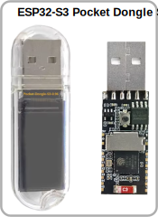
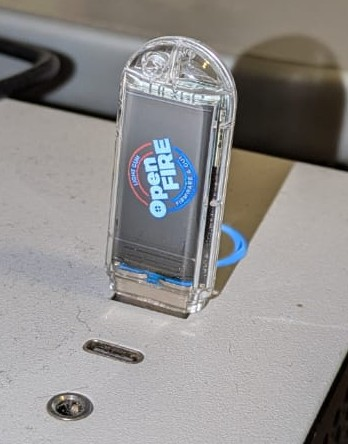
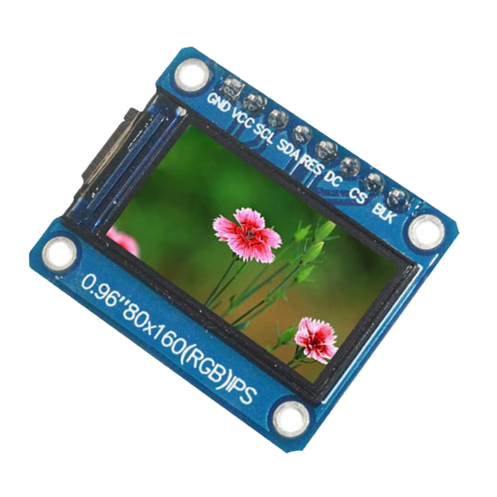
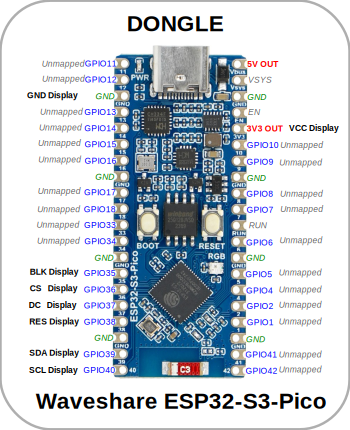
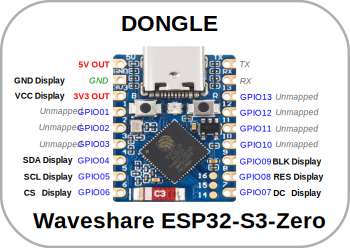
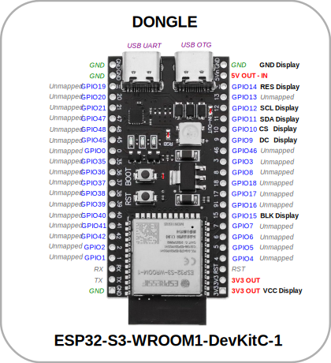
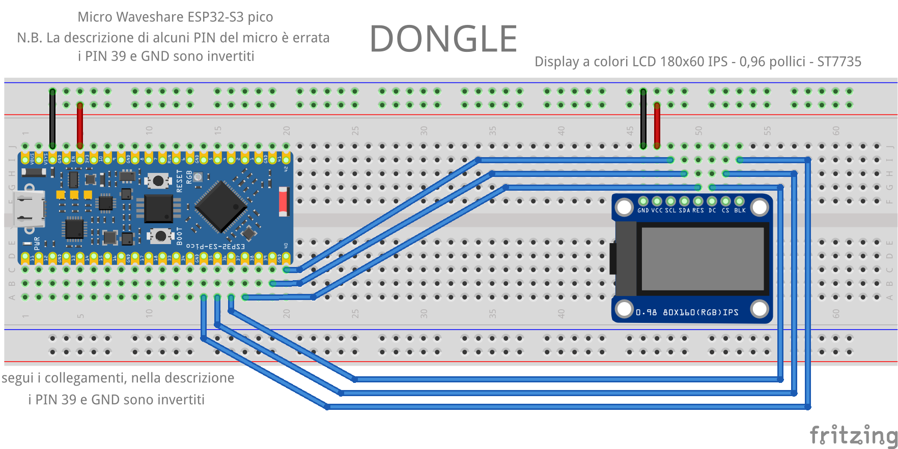

[🏠 Back to Home](../README.md#english-version) / **Dongle Firmware**

  <a href="#english-version"> English Version</a> &nbsp;•&nbsp; <a href="#versione-italiana"> Versione Italiana</a>

# Dongle Firmware (ESP32-S3)

      

  

---
> 🛠️ **Hardware sponsored by [PCBWay](https://www.pcbway.com)**
---

The project, developed using PlatformIO, represents the firmware for an ESP32-S3 to be used as a dongle connected to the PC, in order to enable a wireless connection via the ESP32 ESP-NOW protocol. This dongle is designed to be used in combination with the 'OpenFIRE-Firmware-ESP32' firmware, to be installed on the lightgun.
The code is structured to automatically detect lightguns and configure itself autonomously.
The transmission between the lightgun and the dongle is bidirectional, allowing the lightgun to be used as if it were directly connected to the PC via USB.
The PC detects no difference between a direct connection via USB and a wireless connection via the dongle.

## 🛠️ Supported Hardware and Wiring

To build the Dongle receiver, you can choose two paths: use a pre-assembled "stick" (the fastest and recommended choice) or build the receiver yourself starting from a standard development board.

### 1. "Plug & Play" Solutions (No soldering)

These boards are designed with a USB connector integrated directly into the PCB or feature a ready-to-use male USB port. They do not require any soldering or additional hardware wiring.

* **LILYGO T-Dongle-S3:** Excellent choice. It is compact, features a plastic shell, and has a small built-in color LCD display that the firmware uses to show the connection status and the project logo.
* **ESP32-S3 Pocket Dongle S3:** Another excellent pre-assembled alternative, also equipped with a screen and immediately ready to be connected to the PC or USB hub.

| LILYGO T-Dongle-S3 | ESP32-S3 Pocket Dongle S3 | Installation Example |
| :---: | :---: | :---: |
|  |  |  |

### 2. "Do-It-Yourself" Solution (Wiring on standard development boards)
If you prefer to use a standard development board or want to integrate the receiver into your custom case, you can use boards like the **Waveshare ESP32-S3-PICO**, the ultra-compact **Waveshare ESP32-S3-ZERO**, or the classic **ESP32-S3-DevKitC-1**.

Being generic boards, **you will need to use a USB cable to connect the board to the PC** (the same one you will use to program them) for data communication (USB OTG) / power supply.

| Optional Component | Image |
| :--- | :---: |
| For displaying information, you can use a **160x80 IPS LCD Color Display - 0.96 inches - ST7735**. |  |

> [!NOTE]
> **Connecting a display is not mandatory, but it is highly recommended as it allows you to view useful information such as the assigned player, the name of the connected lightgun, network status, etc.**

Here are the pinouts of the various boards for use as a Dongle receiver:

| Waveshare ESP32-S3-PICO | Waveshare ESP32-S3-ZERO | ESP32-S3-DevKitC-1 |
| :---: | :---: | :---: |
|  |  |  |

 

  <b>Practical wiring example on a Breadboard (Waveshare ESP32-S3-PICO):</b>  
  

---

## 💻 Firmware Installation and Flashing

The firmware loading process (flashing) is identical to the one for the Lightgun. 

### Simplified Procedure with Script (Recommended)
This is the fastest method and does not require the installation of additional software on the computer.

1. Go to the **[Releases](https://github.com/alessandro-satanassi/OpenFIRE-Firmware-ESP32/releases)** page.
2. Download the "Simplified Procedure" ZIP for your specific receiver model (e.g., `Dongle-LILYGO`, `Dongle-PICO`, `Dongle-ZERO`, etc.). 
   > *Warning: make sure to choose the exact file for your board.*
3. Extract the entire content of the ZIP archive into a folder on your PC.
4. Connect the device to the PC via USB port.
5. Run the `flash_firmware` script (on Windows it will be the `.bat` file) and follow the on-screen instructions.

### ⚠️ Troubleshooting
* **Flashing won't start (Connecting...):** Some boards and USB dongles can be reluctant to automatically enter download mode. If the script gets stuck repeating the word `Connecting...`, press and hold the small physical **BOOT** (or `B`) button on the device until the installation begins.
* **Antivirus False Positive (Windows):** The script uses the original `esptool.exe` utility by Espressif. Some antivirus software might block it or flag it as a false positive. The file is 100% safe; you may need to temporarily add it to your exceptions.
* **Manual Installation:** For advanced users, individual `.bin` files are also provided on the Release page to be flashed manually using graphical tools like NodeMCU PyFlasher.

---

## 🔄 Boot and Synchronization Sequence (Pairing)

The Dongle has been programmed to operate completely invisibly to the user. There are no buttons to press to start the search: it does everything by itself.

Here is what happens when you plug it into the PC's USB port:

1. **Environmental Scanning (Smart Channel Selection):** As soon as it's powered, the Dongle silently analyzes the surrounding radio spectrum. It automatically selects the Wi-Fi channel with the least interference to ensure the most stable connection possible (the process takes about 15 seconds; if a display is present, you will see the various phases indicated on screen).
2. **Listening Mode:** Once the channel is chosen, the Dongle switches to listening mode, waiting for a Lightgun to transmit its presence *(if your dongle has a display, you will see a search or wait icon)*.
3. **Pairing:** When you turn on the Lightgun in wireless mode, it sends a signal to advertise its presence in order to connect to a free dongle. The Dongle detects it and the two devices "lock" exclusively.
4. **Operation:** From this moment on, the Dongle will begin translating the incoming ESP-NOW packets from the gun into standard HID commands (Mouse, Keyboard, Gamepad), also managing bidirectional serial port communication. The PC will handle the device exactly as if it were a normal wired controller.
5. **Fast Reconnection:** If for some reason you turn off the gun, but leave the Dongle (already paired) regularly plugged in and powered on the PC, as soon as you turn the lightgun back on, the reconnection will be instantaneous.

> [!IMPORTANT]
> **Dongle Restart and New Pairing**
> Every time you unplug and replug the Dongle from the PC, it resets its memory and restarts the entire sequence from Step 1, becoming ready to connect to another lightgun (or the same one, but through a complete pairing procedure).
> *Consequently, if the Dongle is restarted, you must necessarily **turn off and on your Lightgun as well** to force it to transmit the initial connection signal again.*

---
### 💬 Questions or Issues?
For technical support and to join the discussion, please refer to the [Community & Support Section](../README.md#community-support-english) in the Main Repository.

---

 🔸 🔸 🔸 

---

[🏠 Torna alla Home](../README.md#versione-italiana) / **Dongle Firmware**

  <a href="#english-version"> English Version</a> &nbsp;•&nbsp; <a href="#versione-italiana"> Versione Italiana</a>

# Dongle Firmware (ESP32-S3)

      

  

---
> 🛠️ **Hardware sponsored by [PCBWay](https://www.pcbway.com)**
---

Il progetto, sviluppato utilizzando PlatformIO, rappresenta il firmware per un ESP32-S3 da usare come dongle collegato al PC, al fine di abilitare una connessione wireless tramite il protocollo ESP-NOW di ESP32. Questo dongle è progettato per essere usato in combinazione con il firmware 'OpenFIRE-Firmware-ESP32', da installare sulla lightgun.
Il codice è strutturato per rilevare automaticamente le lightgun e configurarsi in modo autonomo.
La trasmissione tra lightgun e dongle è bidirezionale, consentendo di utilizzare la lightgun come se fosse connessa direttamente al PC via USB.
Il PC non rileva alcuna differenza tra una connessione diretta tramite USB e una connessione wireless tramite dongle.

## 🛠️ Hardware Supportato e Cablaggio

Per realizzare il ricevitore Dongle, puoi optare per due strade: utilizzare una "chiavetta" pre-assemblata (la scelta più rapida e consigliata) oppure autocostruire il ricevitore partendo da una scheda di sviluppo standard.

### 1. Soluzioni "Plug & Play" (Nessuna saldatura)

Queste schede sono progettate con un connettore USB integrato direttamente nel PCB o dispongono di una porta USB maschio pronta all'uso. Non richiedono alcun tipo di saldatura o cablaggio hardware aggiuntivo.

* **LILYGO T-Dongle-S3:** Ottima scelta. È compatta, dispone di un guscio in plastica e di un piccolo display LCD a colori integrato che il firmware utilizza per mostrare lo stato della connessione e il logo del progetto.
* **ESP32-S3 Pocket Dongle S3:** Un'altra eccellente alternativa pre-assemblata, anch'essa dotata di schermo e immediatamente pronta per essere collegata al PC o all'hub USB.

| LILYGO T-Dongle-S3 | ESP32-S3 Pocket Dongle S3 | Esempio Installazione |
| :---: | :---: | :---: |
|  |  |  |

### 2. Soluzione "Fai-da-te" (Cablaggio su schede di sviluppo standard)
Se preferisci utilizzare una scheda di sviluppo standard o vuoi integrare il ricevitore all'interno di un tuo case personalizzato, puoi utilizzare board come la **Waveshare ESP32-S3-PICO**, la compattissima **Waveshare ESP32-S3-ZERO** o la classica **ESP32-S3-DevKitC-1**.

Essendo schede generiche, **dovrai usare un cavo USB per collegare la board al PC** (lo stesso che userai per programmarle) per la comunicazione dati (USB OTG) / alimentazione.

| Componente Opzionale | Immagine |
| :--- | :---: |
| Per la visualizzazione delle informazioni si può utilizzare un **Display a colori LCD 160x80 IPS - 0,96 pollici - ST7735**. |  |

> [!NOTE]
> **Non è obbligatorio connettere un display, ma è fortemente consigliato in quanto permette di visualizzare informazioni utili quali il player assegnato, il nome della lightgun connessa, lo stato della rete, ecc.**

Ecco i pinout delle varie schede per l'utilizzo come ricevitore Dongle:

| Waveshare ESP32-S3-PICO | Waveshare ESP32-S3-ZERO | ESP32-S3-DevKitC-1 |
| :---: | :---: | :---: |
|  |  |  |

 

  <b>Esempio pratico di cablaggio su Breadboard (Waveshare ESP32-S3-PICO):</b>  
  

---

## 💻 Installazione e Flashing del Firmware

Il processo di caricamento del firmware (flashing) è identico a quello previsto per la Lightgun. 

### Procedura Semplificata con Script (Consigliata)
Questo è il metodo più veloce e non richiede l'installazione di software aggiuntivi sul computer.

1. Vai alla pagina delle **[Releases](https://github.com/alessandro-satanassi/OpenFIRE-Firmware-ESP32/releases)**.
2. Scarica lo ZIP "Procedura Semplificata" relativo al tuo specifico modello di ricevitore (es. `Dongle-LILYGO`, `Dongle-PICO`, `Dongle-ZERO`, ecc.). 
   > *Attenzione: assicurati di scegliere il file esatto per la tua scheda.*
3. Estrai l'intero contenuto dell'archivio ZIP in una cartella sul tuo PC.
4. Collega il dispositivo al PC tramite porta USB.
5. Esegui lo script `flash_firmware` (su Windows sarà il file `.bat`) e segui le istruzioni a schermo.

### ⚠️ Risoluzione dei Problemi (Troubleshooting)
* **Il Flashing non parte (Connecting...):** Alcune schede e dongle USB possono essere restii a entrare automaticamente in modalità download. Se lo script si blocca ripetendo la scritta `Connecting...`, tieni premuto il piccolo pulsante fisico **BOOT** (o `B`) presente sul dispositivo finché l'installazione non inizia.
* **Falso Positivo Antivirus (Windows):** Lo script utilizza l'utility `esptool.exe` originale di Espressif. Alcuni software antivirus potrebbero bloccarlo o segnalarlo come falso positivo. Il file è sicuro al 100%; potresti doverlo aggiungere momentaneamente alle eccezioni.
* **Installazione Manuale:** Per gli utenti avanzati, nella pagina delle Release sono forniti anche i singoli file `.bin` da flashare manualmente utilizzando tool grafici come NodeMCU PyFlasher.

---

## 🔄 Sequenza di Avvio e Sincronizzazione (Pairing)

Il Dongle è stato programmato per operare in modo del tutto invisibile all'utente. Non ci sono pulsanti da premere per avviare la ricerca: fa tutto da solo.

Ecco cosa succede quando lo inserisci nella porta USB del PC:

1. **Scansione Ambientale (Smart Channel Selection):** Appena alimentato, il Dongle analizza silenziosamente lo spettro radio dell'ambiente circostante. Seleziona in automatico il canale Wi-Fi con il minor numero di interferenze per garantire la connessione più stabile possibile (il processo dura circa 15 secondi; se è presente un display, vedrai indicate le varie fasi a schermo).
2. **Modalità Ascolto:** Una volta scelto il canale, il Dongle si mette in ascolto in attesa di una Lightgun che trasmetta la sua presenza *(se il tuo dongle ha un display, vedrai un'icona di ricerca o di attesa)*.
3. **Associazione (Pairing):** Quando accendi la Lightgun in modalità wireless, questa invia un segnale per pubblicizzare la sua presenza al fine di connettersi a un dongle libero. Il Dongle la rileva e i due dispositivi si "agganciano" in via esclusiva.
4. **Operatività:** Da questo momento, il Dongle inizierà a tradurre i pacchetti ESP-NOW in arrivo dalla pistola in comandi HID standard (Mouse, Tastiera, Gamepad), gestendo inoltre la comunicazione sulla porta seriale bidirezionale. Il PC gestirà il dispositivo esattamente come se fosse un normale controller cablato.
5. **Riconnessione Veloce:** Se per qualche motivo spegni la pistola, ma lasci il Dongle (già accoppiato) regolarmente inserito e acceso nel PC, non appena riaccenderai la lightgun la riconnessione sarà istantanea.

> [!IMPORTANT]
> **Riavvio del Dongle e nuovo Pairing**
> Ogni volta che scolleghi e ricolleghi il Dongle dal PC, questo resetta la sua memoria e fa ripartire l'intera sequenza dal Punto 1, rendendosi pronto a collegarsi a un'altra lightgun (o alla stessa, ma tramite una procedura di pairing completa).
> *Di conseguenza, in caso di riavvio del Dongle, dovrai necessariamente **spegnere e riaccendere anche la tua Lightgun** per forzarla a trasmettere di nuovo il segnale iniziale di connessione.*

---
### 💬 Domande o Problemi?
Per supporto tecnico e per unirti alla community, consulta la [Sezione Community e Supporto](../README.md#community-support-italiano) nella Home del progetto.
