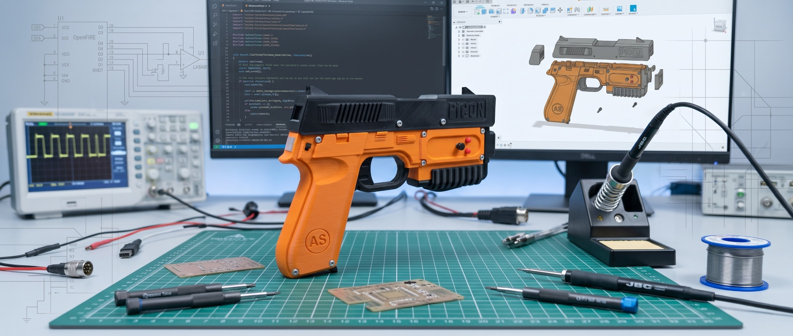
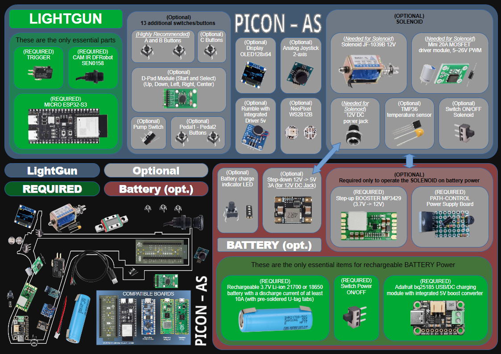
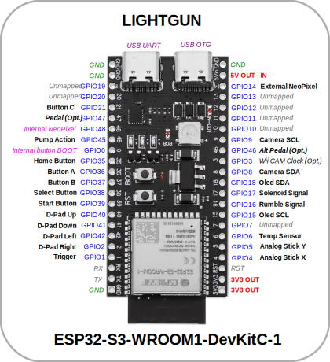
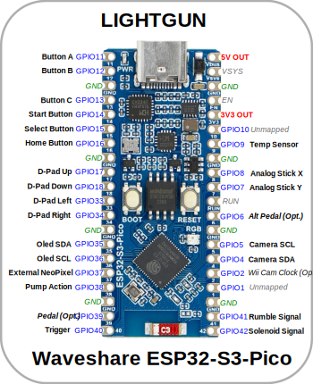
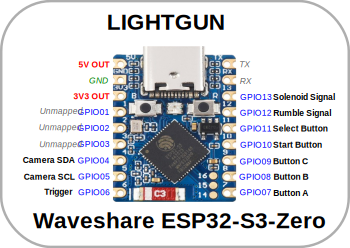

[🏠 Back to Home](../README.md#english-version) / **Lightgun Firmware**

  <a href="#english-version"> English Version</a> &nbsp;•&nbsp; <a href="#versione-italiana"> Versione Italiana</a>

# Lightgun Firmware (ESP32-S3)

      

  

  📖 <b><a href="src/README.md#english-version">OPERATIONAL MANUAL & USER INSTRUCTIONS</a></b>

---
> 🛠️ **Hardware sponsored by [PCBWay](https://www.pcbway.com)**
---

This section contains specific documentation for building and programming the main Lightgun module based on the ESP32-S3.

---

## 🛠️ Hardware Requirements

OpenFIRE's flexibility allows you to build a lightgun ranging from the most basic configuration to a complete arcade system with full feedback.

Below is the reference hardware architecture (based on the PICON-AS ecosystem) illustrating the required core components and the optional add-ons supported by the firmware.

  

### Mandatory Components (Essentials)
For the basic operation of the aiming and shooting system, the following are indispensable:

* **Microcontroller:** An **ESP32-S3** to run the firmware. Recommended and tested boards are:
  * *ESP32-S3-WROOM1-DevKitC-1*
  * *Waveshare ESP32-S3-PICO*
  * *Waveshare ESP32-S3-ZERO (Mini)* *(not yet tested)*  
* **Optical Sensor:** **DFRobot SEN0158** IR positioning camera. *(Alternatively, for experts, an original **Wii CAM** can be used, desoldered from a Wii controller, configuring a specific microcontroller pin to generate the clock signal required for its operation).*
* **IR Emitters:** 4x Infrared LEDs. Although standard Wii sensor bars might work at very close distances, using OSRAM SFH 4547 LEDs with 5.6Ω resistors is **HIGHLY recommended**.
* **Primary Input:** At least 1 switch to use as a trigger.

### Highly Recommended Components
Although the lightgun can work with just the trigger, to fully enjoy almost all existing retro lightgun games, it is highly recommended to add:
* **A and B Buttons:** 2 additional switches to handle reloads or secondary actions.

### Optional Modules:
Feel free to integrate the components you prefer for your custom build:

**🔘 Switches (Buttons):**
The firmware natively manages up to 13 additional switches/buttons (besides the trigger), all fully configurable via the OpenFIRE Desktop App (refer to the subsequent pinout images for mappings):
* **C Button:** An additional switch alongside A and B.
* **D-Pad Module:** A 5-way directional navigation switch (Up, Down, Left, Right, Center).
* **System Buttons:** 2 additional switches dedicated to *Start* and *Select*.
* **Pump Switch:** A switch to simulate pump action reloading.
* **Pedal Button:** A switch for the main pedal *(n.b. do not configure this if using the wireless pedal)*.
* **Alt Pedal Button:** A switch for the secondary pedal, useful for games that require it *(n.b. do not configure this if using the wireless pedal)*.

**🕹️ Additional Controls:**
* **Analog Joystick:** A 2-axis analog joystick module.

**💥 Force Feedback, Haptics, and Hardware Switches:**
* **Solenoid (12V-24V):** Any solenoid paired with its respective MOSFET driver board *(requires a separate adjustable 12-24V power supply)*.
  * *Note for Wireless builds:* Alternatively, strictly for 12V solenoids and 100% wireless builds, you can use a high-discharge (minimum 10A) 3.7V Li-ion battery paired with a powerful booster board like the **MP3429** (3.7V -> 12V). Although both 18650 and 21700 formats are supported, the **21700** is highly recommended to ensure acceptable battery life.
  * *Beware of Interference (EMI):* Solenoids can cause USB or radio disconnections if the wiring is too thin. Solenoid power cables should be at least **24AWG**.
* **Temperature Sensor (TMP36):** To be placed in contact with the solenoid to monitor and prevent component overheating during long gaming sessions.
* **Rumble Motor (5V):** Any gamepad vibration motor with a basic driver board.
* **2-way SPDT Switches:** Very useful for directly adjusting (via hardware on/off) the Rumble, Solenoid, or Rapid Fire state *(note: if you do not install these physical switches, these functions can still be adjusted via software from the menu).*

**💡 Lighting and Display:**
* **NeoPixel:** You can use NeoPixel WS2812B modules for dynamic lighting and real-time in-game reactions.
* **RGB LED:** You can use standard 4-pin RGB LEDs for dynamic lighting and real-time in-game reactions.
* **OLED Display:** A small 128x64 I2C-based (2-wire/4-pin) **SSD1306** screen, extremely useful for providing a visual interface for the menu, connection status, and health/ammo counter feedback.

### Resources and Assembly Guides
You can find purchase links for the components and detailed assembly instructions within my hardware project **[PICON-AS](https://alessandro-satanassi.github.io/OpenFIRE-PICON-AS-ESP32/)**.

I am also attaching some graphic guides for DIY building and component wiring, originally provided by the OpenFIRE project. *Please note: although the images show connections on a Raspberry Pi Pico (RP2040), the wiring logic is identical and applicable to any configured ESP32-S3 pin.*
* **[OpenFIRE Hardware Guide](docs/guide/OpenFIRE-Hardware-Guide_1.2.pdf)**

---

## 📌 Default Board Pinouts

Refer to the following images for the default pinouts of the two recommended boards. 
> **Warning:** Each board supports fully custom layouts. If you decide to solder components to different pins for wiring convenience, you can freely reassign them using the **OpenFIRE Desktop App**.

| ESP32-S3-DevKitC-1 | Waveshare ESP32-S3-PICO | Waveshare ESP32-S3-ZERO |
| :---: | :---: | :---: |
|  |  |  |

---

## 💻 Firmware Installation and Flashing

#### WEB FLASHER (Recommended for all users)
The easiest, fastest, and safest way to install or update the firmware. It does not require installing any drivers or external software: it runs entirely within your browser.
* **Requirements:** PC/Mac with Google Chrome, Microsoft Edge, or Opera.

👉 **[LAUNCH OPENFIRE ESP32 WEB FLASHER](https://alessandro-satanassi.github.io/OpenFIRE-ESP32-WebFlasher/?lang=en)**

---

#### *FOR ADVANCED USERS:*
If your browser does not support the Web Flasher, or if you prefer to proceed via command line or external tools, you can download and install the specific files.

Unlike RP2040 microcontrollers (which use `.UF2` file drag-and-drop), the ESP32-S3 requires flashing binary (`.bin`) files via serial communication. 

To make this process as easy as possible, you will find ready-made packages for each supported board on the **[Releases](https://github.com/alessandro-satanassi/OpenFIRE-Firmware-ESP32/releases)** page.

### Method 1: Simplified Script Procedure
This is the fastest method and does not require installing additional software. Packages are available for **Windows, Linux, and MacOS**.

1. Go to the **[Releases](https://github.com/alessandro-satanassi/OpenFIRE-Firmware-ESP32/releases)** page and download the "Simplified Procedure" ZIP for your board (e.g., `DevKitC-1` or `PICO`).
2. Extract the entire content of the ZIP archive into a folder on your PC.
3. Connect the ESP32-S3 board to your computer via USB cable *(make sure it is a data cable, not just for charging)*.
4. Run the `flash_firmware` script (on Windows it will be a `.bat` file).
5. The script will automatically search for the serial port and guide you through the installation.

> **ℹ️ Update vs. Clean Install (NoFS vs. Full)**
> During the guided procedure for the Lightgun, you will be asked which version to install:
> * **Base Version (NoFS):** Ideal for updates. It only updates the application code, **keeping your calibrations and button mappings intact**.
> * **Complete Version (Full):** To be used for first-time installation. Formats the microcontroller and installs the factory filesystem, **erasing** any previous settings.

### Method 2: Manual Installation
For advanced users who prefer to use GUI tools like **NodeMCU PyFlasher** or the **esptool** command-line utility, individual "merged" `.bin` files ready to be flashed directly to base address `0x0` are also provided on the Release page.

---

### ⚠️ Troubleshooting

* **Flashing won't start (Connecting...):** Some ESP32-S3 boards can be "stubborn" about automatically entering download mode. If you see `Connecting...` repeating during the script without progressing, hold down the small physical **BOOT** (or `B`) button on your ESP32 board until the installation begins.
* **Antivirus False Positive (Windows):** The script uses the original `esptool.exe` from Espressif. Some antivirus software might block it or flag it as a false positive. The file is 100% safe; you may need to add it to your temporary exceptions.
* **Post-Installation Configuration:** Remember that these scripts are *only* for installing the firmware. To configure the lightgun (map pins, buttons, perform IR calibration) you must use the original **OpenFIRE Desktop App**. Check the release notes to download the App version compatible with the firmware.

## 👨‍💻 Technical Information for Developers

If you want to modify the source code, customize low-level mapping, or contribute to the project, the reference development environment for this ESP32 port is **PlatformIO**.

* **Configuration Manual:** We are preparing a technical file dedicated to using and configuring PlatformIO specifically for this project. *(Documentation coming soon)*
* **Compiling the Firmware:** For detailed instructions on how to set up the environment, install the necessary libraries, and compile the firmware from scratch, refer to the developer guide. *(Documentation coming soon)*

## 🚀 Boot Sequence and Connectivity

Upon powering on the lightgun, the firmware executes a precise initialization sequence. Here is what happens step by step:

### 1. Automatic Joystick Calibration
If you have an analog joystick installed, the system detects its center (zero point) as soon as it receives power.
> [!IMPORTANT]
> The procedure takes about two seconds. During this phase, **DO NOT touch the joystick** to ensure proper calibration.

### 2. Connectivity Management (USB vs Wireless)
The system intelligently determines how to communicate with the PC:
* **Wired Connection:** If the USB cable is already connected to the PC at startup, the lightgun immediately enters wired mode, disabling the radio to save power.
* **Wireless Connection (ESP-NOW):** If the USB cable is disconnected, the wireless sequence begins:
  1. The **Dongle** (already connected to the PC) scans the environment, selects the Wi-Fi channel with the least interference for optimal transmission, and starts listening.
  2. The **Lightgun** repeatedly advertises its presence on all channels until a free Dongle responds. *(Note: if you decide to plug in the USB cable during this waiting phase, the system interrupts the search and instantly switches to wired mode).*
  3. Once the Dongle is detected, **Pairing** occurs. From this moment on, the PC will handle the peripheral exactly as if it were connected via cable, with no difference in performance.

### 3. Wireless Pedal Search (Optional)
Immediately after pairing with the Dongle (and provided a *wired* pedal is not already configured directly to the lightgun), the gun opens a **10-second** window during which it searches for a free wireless Pedal on the newly agreed radio channel.
* If it finds a Pedal, it pairs it to its profile. The LEDs on the pedal will physically indicate which Player it has been assigned to.
* If no Pedal is found after 10 seconds, the boot process concludes normally, and you are ready to play (the pedal is entirely optional).

### 4. Fast Reconnection
In the event the lightgun alone is powered off and restarted (for example, due to shutdown from a low battery), the system will prioritize searching for the last Dongle and Pedal it was paired with to ensure a near-instant connection. 
* *Note:* This fast reconnection only occurs if the Dongle and Pedal have remained continuously powered on since the initial pairing. If they have been restarted, they will revert to a "new search" state, and the lightgun will need to perform a full channel scan.

### 5. Connection Status (Visual Feedback)
If your lightgun is equipped with an OLED display, the main interface will show an icon at the top to confirm the working status:
* 🛜 **Wi-Fi Icon:** Connection established via wireless Dongle.
* 🔌 **USB Icon:** Wired connection active.

---

## 📖 Operational Manual and User Instructions

> [!IMPORTANT]
> **Have you finished assembling and flashing the firmware? Great job, but you're not done yet!**
> 
> To properly use your lightgun and fully exploit its potential, it is **crucial** to understand how to interact with the system. The gun features internal menus, button combinations, and specific calibration procedures that you need to know.

In the **Operational Manual**, you will find all the essential information on:

* 🎯 **Calibration Procedure:** How to perform the on-screen calibration to ensure perfect line-of-sight aiming.
* 🎮 **Controls and Shortcuts:** What the default button functions are and how to access "Pause Mode".
* 💾 **Profile Management:** How to switch between profiles and save your configurations to the gun's internal memory.
* ⚙️ **On-the-Fly Adjustments:** How to turn the Rumble and Solenoid on/off directly from the gun and adjust the IR camera sensitivity.

👉 **[CLICK HERE TO READ THE FULL OPERATIONAL MANUAL](src/README.md#english-version)**

---
### 💬 Questions or Issues?
For technical support and to join the discussion, please refer to the [Community & Support Section](../README.md#community-support-english) in the Main Repository.

---

 🔸 🔸 🔸 

---

[🏠 Torna alla Home](../README.md#versione-italiana) / **Lightgun Firmware**

  <a href="#english-version"> English Version</a> &nbsp;•&nbsp; <a href="#versione-italiana"> Versione Italiana</a>

# Lightgun Firmware (ESP32-S3)

      

  

  📖 <b><a href="src/README.md#versione-italiana">MANUALE OPERATIVO E ISTRUZIONI PER L'USO</a></b>

---
> 🛠️ **Hardware sponsored by [PCBWay](https://www.pcbway.com)**
---

Questa sezione contiene la documentazione specifica per la costruzione e la programmazione del modulo principale della Lightgun basato su ESP32-S3.

---

## 🛠️ Requisiti Hardware

La flessibilità di OpenFIRE ti permette di costruire una lightgun che va dalla configurazione più basilare a un sistema arcade completo di ogni feedback.

Di seguito lo schema di architettura hardware di riferimento (basato sull'ecosistema PICON-AS) che illustra i componenti base necessari e i moduli opzionali supportati dal firmware.

  

### Componenti Obbligatori (Essenziali)
Per il funzionamento di base del sistema di puntamento e sparo, sono indispensabili:

* **Microcontrollore:** Un **ESP32-S3** per eseguire il firmware. Le schede consigliate e testate sono:
  * *ESP32-S3-WROOM1-DevKitC-1*
  * *Waveshare ESP32-S3-PICO*
  * *Waveshare ESP32-S3-ZERO (Mini)* *(non ancora testata)*
* **Sensore Ottico:** Telecamera di posizionamento IR **DFRobot SEN0158**. *(In alternativa, per gli esperti, è possibile utilizzare una **Wii CAM** originale, da smontare da un controller Wii, configurando un pin specifico del microcontrollore per generare il segnale di clock necessario al suo funzionamento).*
* **Emettitori IR:** 4x LED Infrarossi. Sebbene le normali barre sensore della Wii possano funzionare a distanze molto ravvicinate, è **ALTAMENTE consigliato** l'utilizzo di LED OSRAM SFH 4547 con resistenze da 5.6Ω.
* **Input Primario:** Almeno 1 interruttore da utilizzare come grilletto (Trigger).

### Componenti Altamente Consigliati
Sebbene la lightgun possa funzionare con il solo grilletto, per poter fruire appieno della quasi totalità dei giochi retrogame per lightgun si consiglia caldamente di aggiungere:
* **Pulsanti A e B:** 2 interruttori aggiuntivi per gestire le ricariche o le azioni secondarie.

### Moduli Opzionali:
Sentiti libero di integrare i componenti che preferisci per la tua build personalizzata:

**🔘 Interruttori (Pulsanti):**
Il firmware può gestire nativamente fino a 13 interruttori/pulsanti aggiuntivi (oltre al grilletto), tutti completamente configurabili tramite la OpenFIRE Desktop App (fai riferimento alle immagini dei pinout successivi per le mappature):
* **Pulsante C:** Un ulteriore interruttore oltre ad A e B.
* **Modulo D-Pad:** Un interruttore di navigazione direzionale a 5 vie (Su, Giù, Sinistra, Destra, Centro).
* **Pulsanti di Sistema:** 2 interruttori aggiuntivi dedicati a *Start* e *Select*.
* **Switch a Pompa:** Un interruttore per simulare la ricarica a pompa (Pump action).
* **Pulsante Pedal:** Un interruttore per il pedale principale *(n.b. non configurarlo se si utilizza il pedale wireless)*.
* **Pulsante Alt Pedal:** Un interruttore per il secondo pedale, utile per i giochi che lo richiedono *(n.b. non configurarlo se si utilizza il pedale wireless)*.

**🕹️ Controlli Aggiuntivi:**
* **Joystick Analogico:** Un modulo joystick analogico a 2 assi.

**💥 Feedback di Forza, Aptico e Interruttori Hardware:**
* **Solenoide (12V-24V):** Qualsiasi solenoide abbinato alla relativa scheda driver MOSFET *(richiede un alimentatore separato regolabile da 12-24V)*.
  * *Nota per build Wireless:* In alternativa, solo per solenoidi a 12V e build 100% senza fili, è possibile utilizzare una batteria Li-ion da 3.7V ad alta scarica (minimo 10A) abbinata a una scheda booster potente come l'**MP3429** (3.7V -> 12V). Sebbene siano supportati i formati 18650 e 21700, la **21700** è altamente consigliata per garantire una durata accettabile.
  * *Attenzione alle interferenze (EMI):* I solenoidi possono causare disconnessioni USB o radio se il cablaggio è troppo sottile. I cavi per l'alimentazione del solenoide dovrebbero essere di almeno **24AWG**.
* **Sensore di Temperatura (TMP36):** Da posizionare a contatto sul solenoide per monitorare ed evitare surriscaldamenti del componente dopo lunghe sessioni di gioco.
* **Motore Rumble (5V):** Qualsiasi motorino di vibrazione per gamepad con relativa scheda driver di base.
* **Interruttori SPDT a 2 vie:** Utilissimi per regolare direttamente via hardware (on/off) lo stato di Rumble, Solenoide o Fuoco Rapido *(nota: se non installi questi switch fisici, tali funzioni potranno comunque essere regolate via software dal menu).*

**💡 Illuminazione e Display:**
* **NeoPixel:** È possibile utilizzare i moduli NeoPixel WS2812B per l'illuminazione dinamica e le reazioni in-game in tempo reale.
* **LED RGB:** È possibile utilizzare i classici LED RGB a 4 pin per l'illuminazione dinamica e le reazioni in-game in tempo reale.
* **Display OLED:** Un piccolo schermo 128x64 basato su I2C (2 fili/4 pin) modello **SSD1306**, utilissimo per avere un'interfaccia visiva per il menu, lo stato della connessione e il feedback dei contatori di vita/munizioni.

### Risorse e Guide all'Assemblaggio
Puoi trovare link per l'acquisto dei componenti e istruzioni di montaggio dettagliate all'interno del mio progetto hardware **[PICON-AS](https://alessandro-satanassi.github.io/OpenFIRE-PICON-AS-ESP32/)**.

Allego inoltre alcune guide grafiche per l'autocostruzione e la connessione dei componenti, originariamente fornite dal progetto OpenFIRE. *Nota bene: sebbene le immagini mostrino i collegamenti su un Raspberry Pi Pico (RP2040), la logica di cablaggio è identica e applicabile a qualsiasi pin configurato dell'ESP32-S3.*
* **[Guida Componenti OpenFIRE](docs/guide/OpenFIRE-Hardware-Guide_1.2.pdf)**

---

## 📌 Pinout di Default delle Board

Fai riferimento alle seguenti immagini per i pinout predefiniti delle due schede consigliate. 
> **Attenzione:** Ogni scheda supporta layout completamente personalizzati. Se decidi di saldare i componenti su pin differenti per comodità di cablaggio, potrai riassegnarli liberamente tramite la **OpenFIRE Desktop App**.

| ESP32-S3-DevKitC-1 | Waveshare ESP32-S3-PICO | Waveshare ESP32-S3-ZERO |
| :---: | :---: | :---: |
|  |  |  |

---

## 💻 Installazione e Flashing del Firmware

####  WEB FLASHER (Consigliato per qualsiasi utente)
Il modo più semplice, veloce e sicuro per installare o aggiornare il firmware. Non richiede l'installazione di driver o software esterni: viene eseguito interamente dal tuo browser.
* **Requisiti:** PC/Mac con Google Chrome, Microsoft Edge o Opera.

👉 **[AVVIA OPENFIRE ESP32 WEB FLASHER](https://alessandro-satanassi.github.io/OpenFIRE-ESP32-WebFlasher/?lang=it)**

---

#### *PER UTENTI ESPERTI:*
Se il tuo browser non supporta il Web Flasher, o se preferisci procedere tramite riga di comando o tool esterni, puoi scaricare ed installare i file specifici.

A differenza dei microcontrollori RP2040 (che utilizzano il drag-and-drop di file `.UF2`), l'ESP32-S3 richiede il caricamento di file binari (`.bin`) tramite comunicazione seriale. 

Per rendere questa operazione il più semplice possibile, nella pagina delle **[Releases](https://github.com/alessandro-satanassi/OpenFIRE-Firmware-ESP32/releases)** troverai pacchetti già pronti per ogni scheda supportata.

### Metodo 1: Procedura Semplificata con Script
Questo è il metodo più veloce e non richiede l'installazione di software aggiuntivi. I pacchetti sono disponibili per **Windows, Linux e MacOS**.

1. Vai alla pagina delle **[Releases](https://github.com/alessandro-satanassi/OpenFIRE-Firmware-ESP32/releases)** e scarica lo ZIP "Procedura Semplificata" relativo alla tua board (es. `DevKitC-1` o `PICO`).
2. Estrai l'intero contenuto dell'archivio ZIP in una cartella sul tuo PC.
3. Collega la scheda ESP32-S3 al computer tramite cavo USB *(assicurati che sia un cavo dati, non solo per la ricarica)*.
4. Esegui lo script `flash_firmware` (su Windows sarà il file `.bat`).
5. Lo script cercherà automaticamente la porta seriale e ti guiderà nell'installazione.

> **ℹ️ Aggiornamento vs Installazione Pulita (NoFS vs Full)**
> Durante la procedura guidata per la Lightgun, ti verrà chiesto quale versione installare:
> * **Versione Base (NoFS):** Ideale per gli aggiornamenti. Aggiorna solo il codice applicativo, **mantenendo intatte** le tue calibrazioni e mappature dei pulsanti.
> * **Versione Completa (Full):** Da usare per la prima installazione. Formatta il microcontrollore e installa il filesystem di fabbrica, **cancellando** ogni impostazione precedente.

### Metodo 2: Installazione Manuale
Per gli utenti avanzati che preferiscono utilizzare tool grafici come **NodeMCU PyFlasher** o l'utility a riga di comando **esptool**, nella pagina delle Release sono forniti anche i singoli file `.bin` "merged" pronti per essere flashati direttamente all'indirizzo di base `0x0`.

---

### ⚠️ Risoluzione dei Problemi (Troubleshooting)

* **Il Flashing non parte (Connecting...):** Alcune schede ESP32-S3 possono essere "capricciose" nell'entrare automaticamente in modalità download. Se durante lo script vedi la scritta `Connecting...` che si ripete senza avanzare, tieni premuto il piccolo pulsante fisico **BOOT** (o `B`) sulla tua scheda ESP32 finché l'installazione non inizia.
* **Falso Positivo Antivirus (Windows):** Lo script utilizza `esptool.exe` originale di Espressif. Alcuni antivirus potrebbero bloccarlo o segnalarlo come falso positivo. Il file è sicuro al 100%, potresti doverlo aggiungere alle eccezioni temporanee.
* **Configurazione Post-Installazione:** Ricorda che questi script servono *solo* a installare il firmware. Per configurare la lightgun (mappare i pin, i pulsanti, effettuare la calibrazione IR) dovrai utilizzare la **OpenFIRE Desktop App** originale. Controlla le note di release per scaricare la versione dell'App compatibile con il firmware.

## 👨‍💻 Informazioni Tecniche per gli Sviluppatori

Se desideri modificare il codice sorgente, personalizzare la mappatura a basso livello o contribuire al progetto, l'ambiente di sviluppo di riferimento per questo porting ESP32 è **PlatformIO**.

* **Manuale di Configurazione:** Stiamo preparando un file tecnico dedicato all'uso e alla configurazione di PlatformIO specifico per questo progetto. *(Documentazione in arrivo)*
* **Compilazione del Firmware:** Per le istruzioni dettagliate su come configurare l'ambiente, installare le librerie necessarie e compilare il firmware da zero, fai riferimento alla guida per sviluppatori. *(Documentazione in arrivo)*

## 🚀 Sequenza di Avvio e Connettività

All'accensione della lightgun, il firmware esegue una sequenza di inizializzazione precisa. Ecco cosa succede passo dopo passo:

### 1. Calibrazione Automatica del Joystick
Se hai installato un joystick analogico, il sistema ne rileva il centro (punto zero) non appena riceve alimentazione.
> [!IMPORTANT]
> La procedura dura circa due secondi. Durante questa fase **NON toccare il joystick** per garantire una calibrazione corretta.

### 2. Gestione della Connettività (USB vs Wireless)
Il sistema determina in modo intelligente come comunicare con il PC:
* **Connessione via Cavo:** Se all'accensione il cavo USB è già collegato al PC, la lightgun entra immediatamente in modalità cablata disabilitando la radio per risparmiare energia.
* **Connessione Wireless (ESP-NOW):** Se il cavo USB è scollegato, inizia la sequenza senza fili:
  1. Il **Dongle** (già collegato al PC) scansiona l'ambiente, seleziona il canale Wi-Fi con minori interferenze per garantire una trasmissione ottimale e si mette in ascolto.
  2. La **Lightgun** trasmette ("pubblicizza") la sua presenza su tutti i canali a ripetizione, fino a quando un Dongle libero non le risponde. *(Nota: se in questa fase di attesa decidi di collegare il cavo USB, il sistema interrompe la ricerca e passa istantaneamente alla modalità cablata).*
  3. Una volta rilevato il Dongle, avviene l'**associazione (Pairing)**. Da questo momento, il PC gestirà la periferica esattamente come se fosse collegata via cavo, senza alcuna differenza di prestazioni.

### 3. Ricerca del Pedale Wireless (Opzionale)
Subito dopo l'associazione con il Dongle (e a patto che non sia già stato configurato un pedale *cablato* direttamente alla lightgun), la pistola avvia una finestra di **10 secondi** in cui cerca un Pedale wireless libero sul canale radio appena concordato.
* Se trova un Pedale, lo associa al suo profilo. I LED sul pedale indicheranno fisicamente a quale Player è stato assegnato.
* Se non trova alcun Pedale allo scadere dei 10 secondi, il processo di avvio si conclude regolarmente e si è pronti a giocare (il pedale è del tutto facoltativo).

### 4. Riconnessione Rapida
In caso di spegnimento e riavvio della sola lightgun (ad esempio per spegnimento per batteria scarica), il sistema cercherà prioritariamente l'ultimo Dongle e l'ultimo Pedale a cui era associata per garantire una connessione quasi istantanea. 
* *Nota bene:* Questa riconnessione veloce avviene solo se il Dongle e il Pedale sono rimasti ininterrottamente alimentati dopo il primo pairing. Se sono stati riavviati, torneranno in stato di "nuova ricerca" e la lightgun dovrà effettuare una scansione completa dei canali.

### 5. Stato della Connessione (Feedback Visivo)
Se la tua lightgun è dotata di un display OLED, l'interfaccia principale mostrerà un'icona in alto per confermare lo stato di lavoro:
* 🛜 **Icona Wi-Fi:** Connessione stabilita tramite Dongle wireless.
* 🔌 **Icona USB:** Connessione cablata attiva.

---

## 📖 Manuale Operativo e Istruzioni d'Uso

> [!IMPORTANT]
> **Hai terminato l'assemblaggio e flashato il firmware? Ottimo lavoro, ma non è finita qui!**
> 
> Per poter utilizzare correttamente la tua lightgun e sfruttarne appieno le potenzialità, è **fondamentale** capire come interagire con il sistema. La pistola possiede menu interni, combinazioni di pulsanti e procedure di calibrazione specifiche che devi conoscere.

Nel **Manuale Operativo** troverai tutte le informazioni essenziali su:

* 🎯 **Procedura di Calibrazione:** Come effettuare la calibrazione a schermo per garantire una mira perfetta (line-of-sight).
* 🎮 **Comandi e Scorciatoie:** Quali sono le funzioni dei pulsanti predefiniti e come accedere alla "Modalità Pausa".
* 💾 **Gestione dei Profili:** Come passare da un profilo all'altro e salvare le tue configurazioni sulla memoria della pistola.
* ⚙️ **Regolazioni On-the-Fly:** Come accendere/spegnere Rumble e Solenoide direttamente dalla pistola e regolare la sensibilità della telecamera IR.

👉 **[CLICCA QUI PER LEGGERE IL MANUALE OPERATIVO COMPLETO](src/README.md#versione-italiana)**

---
### 💬 Domande o Problemi?
Per supporto tecnico e per unirti alla community, consulta la [Sezione Community e Supporto](../README.md#community-support-italiano) nella Home del progetto.