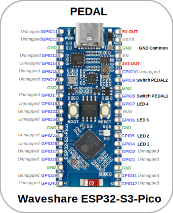
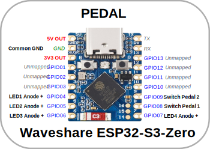
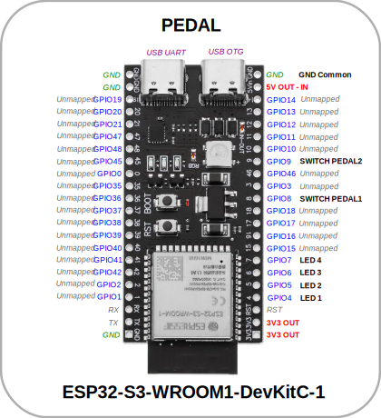
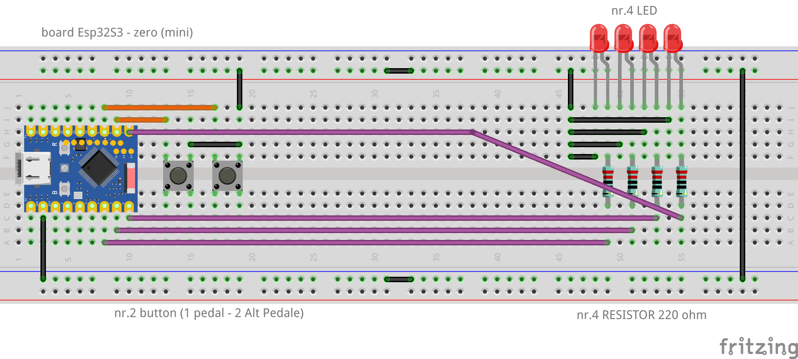

[🏠 Back to Home](../README.md#english-version) / **Pedal Firmware**

  <a href="#english-version"> English Version</a> &nbsp;•&nbsp; <a href="#versione-italiana"> Versione Italiana</a>

# Pedal Firmware (ESP32-S3)

      

  

---
> 🛠️ **Hardware sponsored by [PCBWay](https://www.pcbway.com)**
---

The project, developed using PlatformIO, represents the firmware for the Wireless Pedal, designed specifically to support the game mechanics of arcade-derived "cover shooter" titles (such as the famous *Time Crisis* series). 
Operating in a completely wireless mode, it allows the user to position it freely on the floor, eliminating any annoying physical constraints with the PC or the gun. To meet the strict responsiveness requirements imposed by arcade games, the pedal leverages the power of the ESP-NOW protocol, guaranteeing ultra-low latency. 
The system is totally "Plug & Play" and does not require any additional management software: the Lightgun instantly receives the wireless signal from the pedal and translates it into a standard input, exactly as if it were physically connected via cable.

## 🛠️ Supported Hardware and Wiring

To build the Wireless Pedal, you will need to wire the components to a standard development board. You can use boards like the ultra-compact **Waveshare ESP32-S3-ZERO** (highly recommended due to space constraints inside the pedal chassis), the **Waveshare ESP32-S3-PICO**, or the classic **ESP32-S3-DevKitC-1**.

### Pedal Components

The firmware manages up to two physical pedals and provides visual feedback via 4 LEDs.

| Component | Type | Description |
| :--- | :---: | :--- |
| **Pedal 1 (Main)** | **Mandatory** | The microswitch or physical pedal button. Without this input, the device has no utility. |
| **Pedal 2 (Secondary)** | *Optional* | A second input for dual-pedal configurations (e.g., for specific arcade titles or extra functions). |
| **4x Status LEDs** | *Optional* | Four standard LEDs to display boot status, searching, and successful connection. |

> [!NOTE]
> **The LEDs and the second pedal are not mandatory for basic operation.** If you decide to omit them, make sure to leave the corresponding contacts disconnected. 

Here are the graphical pinouts of the various boards for use as a Pedal:

| Waveshare ESP32-S3-PICO | Waveshare ESP32-S3-ZERO | ESP32-S3-DevKitC-1 |
| :---: | :---: | :---: |
|  |  |  |

 

  <b>Practical wiring example on a Breadboard (Waveshare ESP32-S3-ZERO):</b>  
  

---

## 💻 Firmware Installation and Flashing

The firmware loading process (flashing) is identical to the one for the Lightgun and the Dongle. 

### Simplified Procedure with Script (Recommended)
This is the fastest method and does not require the installation of additional software on the computer.

1. Go to the **[Releases](https://github.com/alessandro-satanassi/OpenFIRE-Firmware-ESP32/releases)** page.
2. Download the "Simplified Procedure" ZIP for your specific pedal model (e.g., `Pedal-ZERO` or `Pedal-DevKitC`). 
   > *Warning: make sure to choose the exact file for your board.*
3. Extract the entire content of the ZIP archive into a folder on your PC.
4. Connect the device to the PC via USB port.
5. Run the `flash_firmware` script (on Windows it will be the `.bat` file) and follow the on-screen instructions.

### ⚠️ Troubleshooting
* **Flashing won't start (Connecting...):** Some boards can be reluctant to automatically enter download mode. If the script gets stuck repeating the word `Connecting...`, press and hold the small physical **BOOT** (or `B`) button on the device until the installation begins.
* **Antivirus False Positive (Windows):** The script uses the original `esptool.exe` utility by Espressif. Some antivirus software might block it or flag it as a false positive. The file is 100% safe; you may need to temporarily add it to your exceptions.
* **Manual Installation:** For advanced users, individual `.bin` files are also provided on the Release page to be flashed manually using graphical tools like NodeMCU PyFlasher.

---

## 🔄 Boot and Synchronization Sequence (Pairing)

The Pedal operates completely autonomously and without pairing switches. Pairing with the Lightgun occurs within a specific "time window" at startup.

Here is what happens to establish the connection:

1. **Pedal Power-on:** As soon as it is powered (via battery or power bank), the Pedal enters a "silent listening" state *(if you have connected the 4 LEDs, you will see an animation indicating the waiting state, with the LEDs scanning back and forth like KITT from Knight Rider)*.
2. **Lightgun Search Window:** When you turn on your wireless Lightgun, it first connects to the Dongle on the PC. Immediately after, it opens a **10-second** search window dedicated exclusively to the pedal.
3. **Pairing:** If the Pedal is powered on and within range during these 10 seconds, the Lightgun detects it, "locks" onto it exclusively, and stops searching *(the LEDs on the pedal will confirm the successful connection, and LED 1, 2, 3, or 4 will remain solidly lit depending on the player assigned to the lightgun)*.
4. **Operation:** From this moment on, physical presses on the pedal are instantly transmitted to the gun, which processes them and sends them to the PC along with the trigger and optical tracking data.
5. **Fast Reconnection:** If for some reason you turn off the gun, but leave the Pedal and the Dongle (both already paired) powered on, as soon as you turn the lightgun back on, the reconnection to the pedal will be instantaneous, skipping the 10-second search.

> [!IMPORTANT]
> **Pedal Restart and New Pairing**
> Every time you turn the Pedal off and back on (or disconnect its power supply), it resets its memory and returns to Step 1, waiting for a connection.
> *Consequently, if the Pedal is restarted, you must necessarily **turn off and on your Lightgun as well** to force it to reopen the famous "10-second window" and allow it to transmit the initial connection signal again.*

---
### 💬 Questions or Issues?
For technical support and to join the discussion, please refer to the [Community & Support Section](../README.md#community-support-english) in the Main Repository.

---

 🔸 🔸 🔸 

---

[🏠 Torna alla Home](../README.md#versione-italiana) / **Pedal Firmware**

  <a href="#english-version"> English Version</a> &nbsp;•&nbsp; <a href="#versione-italiana"> Versione Italiana</a>

# Pedal Firmware (ESP32-S3)

      

  

---
> 🛠️ **Hardware sponsored by [PCBWay](https://www.pcbway.com)**
---

Il progetto, sviluppato utilizzando PlatformIO, rappresenta il firmware per il Pedale Wireless, progettato specificamente per supportare le meccaniche di gioco dei titoli "cover shooter" di derivazione arcade (come la celebre serie *Time Crisis*). 
Operando in modalità completamente senza fili, consente all'utente di posizionarlo liberamente sul pavimento, eliminando qualsiasi fastidioso vincolo fisico con il PC o con la pistola. Per soddisfare i severi requisiti di reattività imposti dai giochi arcade, il pedale sfrutta la potenza del protocollo ESP-NOW, garantendo latenze bassissime. 
Il sistema è totalmente "Plug & Play" e non richiede alcun software di gestione aggiuntivo: la Lightgun riceve istantaneamente il segnale wireless dal pedale e lo traduce in un input standard, esattamente come se quest'ultimo fosse collegato fisicamente via cavo.

## 🛠️ Hardware Supportato e Cablaggio

Per realizzare il Pedale Wireless, dovrai cablare i componenti su una scheda di sviluppo standard. Puoi utilizzare board come la compattissima **Waveshare ESP32-S3-ZERO** (la più consigliata per motivi di spazio all'interno dello chassis del pedale), la **Waveshare ESP32-S3-PICO** o la classica **ESP32-S3-DevKitC-1**.

### Componenti del Pedale

Il firmware gestisce fino a due pedali fisici e fornisce un feedback visivo tramite 4 LED.

| Componente | Tipologia | Descrizione |
| :--- | :---: | :--- |
| **Pedale 1 (Principale)** | **Obbligatorio** | Il microswitch o pulsante fisico del pedale. Senza questo ingresso, il dispositivo non ha utilità. |
| **Pedale 2 (Secondario)** | *Opzionale* | Un secondo ingresso per configurazioni a doppio pedale (es. per titoli arcade specifici o funzioni extra). |
| **4x LED di Stato** | *Opzionali* | Quattro LED standard per visualizzare lo stato dell'avvio, la ricerca e l'avvenuta connessione. |

> [!NOTE]
> **I LED e il secondo pedale non sono obbligatori per il funzionamento di base.** Se decidi di ometterli, assicurati comunque di non collegare i relativi contatti. 

Ecco gli schemi grafici delle varie schede per l'utilizzo come Pedale:

| Waveshare ESP32-S3-PICO | Waveshare ESP32-S3-ZERO | ESP32-S3-DevKitC-1 |
| :---: | :---: | :---: |
|  |  |  |

 

  <b>Esempio pratico di cablaggio su Breadboard (Waveshare ESP32-S3-ZERO):</b>  
  

---

## 💻 Installazione e Flashing del Firmware

Il processo di caricamento del firmware (flashing) è identico a quello previsto per la Lightgun e per il Dongle. 

### Procedura Semplificata con Script (Consigliata)
Questo è il metodo più veloce e non richiede l'installazione di software aggiuntivi sul computer.

1. Vai alla pagina delle **[Releases](https://github.com/alessandro-satanassi/OpenFIRE-Firmware-ESP32/releases)**.
2. Scarica lo ZIP "Procedura Semplificata" relativo al tuo specifico modello di pedale (es. `Pedal-ZERO` o `Pedal-DevKitC`). 
   > *Attenzione: assicurati di scegliere il file esatto per la tua scheda.*
3. Estrai l'intero contenuto dell'archivio ZIP in una cartella sul tuo PC.
4. Collega il dispositivo al PC tramite porta USB.
5. Esegui lo script `flash_firmware` (su Windows sarà il file `.bat`) e segui le istruzioni a schermo.

### ⚠️ Risoluzione dei Problemi (Troubleshooting)
* **Il Flashing non parte (Connecting...):** Alcune schede possono essere restie a entrare automaticamente in modalità download. Se lo script si blocca ripetendo la scritta `Connecting...`, tieni premuto il piccolo pulsante fisico **BOOT** (o `B`) presente sul dispositivo finché l'installazione non inizia.
* **Falso Positivo Antivirus (Windows):** Lo script utilizza l'utility `esptool.exe` originale di Espressif. Alcuni software antivirus potrebbero bloccarlo o segnalarlo come falso positivo. Il file è sicuro al 100%; potresti doverlo aggiungere momentaneamente alle eccezioni.
* **Installazione Manuale:** Per gli utenti avanzati, nella pagina delle Release sono forniti anche i singoli file `.bin` da flashare manualmente utilizzando tool grafici come NodeMCU PyFlasher.

---

## 🔄 Sequenza di Avvio e Sincronizzazione (Pairing)

Il Pedale opera in totale autonomia e senza interruttori di pairing. L'associazione con la Lightgun avviene in una specifica "finestra temporale" all'avvio.

Ecco cosa succede per instaurare la connessione:

1. **Accensione del Pedale:** Appena alimentato (tramite batteria o power bank), il Pedale si mette in stato di "ascolto silenzioso" *(se hai collegato i 4 LED, vedrai un'animazione che indica lo stato di attesa, con i LED che scorrono avanti e indietro come KITT di Supercar)*.
2. **Finestra di Ricerca della Lightgun:** Quando accendi la tua Lightgun wireless, quest'ultima si collega prima al Dongle sul PC. Immediatamente dopo, apre una finestra di ricerca di **10 secondi** dedicata esclusivamente al pedale.
3. **Associazione (Pairing):** Se il Pedale è acceso e nel raggio d'azione durante questi 10 secondi, la Lightgun lo rileva, si "aggancia" in via esclusiva e interrompe la ricerca *(i LED sul pedale confermeranno l'avvenuta connessione e rimarrà acceso in modo fisso il LED 1, 2, 3 o 4 a seconda del player assegnato alla lightgun)*.
4. **Operatività:** Da questo momento, le pressioni fisiche sul pedale vengono trasmesse istantaneamente alla pistola, che le elabora e le invia al PC insieme al grilletto e al tracciamento ottico.
5. **Riconnessione Veloce:** Se per qualche motivo spegni la pistola, ma lasci il Pedale e il Dongle (entrambi già accoppiati) accesi, non appena riaccenderai la lightgun la riconnessione al pedale sarà istantanea, saltando i 10 secondi di ricerca.

> [!IMPORTANT]
> **Riavvio del Pedale e nuovo Pairing**
> Ogni volta che spegni e riaccendi il Pedale (o ne scolleghi l'alimentazione), questo resetta la sua memoria e torna al Punto 1, mettendosi in attesa.
> *Di conseguenza, in caso di riavvio del Pedale, dovrai necessariamente **spegnere e riaccendere anche la tua Lightgun** per forzarla a riaprire la famosa "finestra di 10 secondi" e permetterle di trasmettere di nuovo il segnale iniziale di connessione.*

---
### 💬 Domande o Problemi?
Per supporto tecnico e per unirti alla community, consulta la [Sezione Community e Supporto](../README.md#community-support-italiano) nella Home del progetto.
